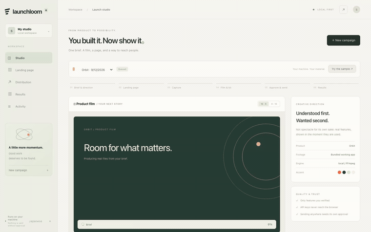
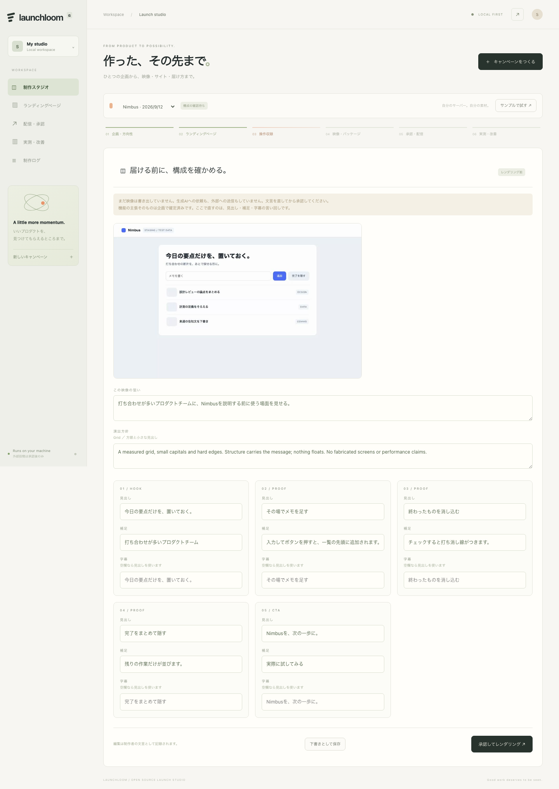

<div align="center">

# Launchloom

**You built it. Now it needs a film, a page, and something to post.**

Launchloom turns one product brief and a real recording of your product into a
landscape film, a vertical cut, a landing page and reviewable social drafts —
from the same plan, on your own machine.

[](https://github.com/FORIFOR/Launchloom/actions/workflows/check.yml)
[](LICENSE)
[](docs/VERIFICATION.md)
[](pyproject.toml)
[](#what-it-does-not-do)
[](README.ja.md)

**[Watch what it makes → forifor.github.io/Launchloom](https://forifor.github.io/Launchloom/)**



*One click. A real app is driven and recorded, a film is cut in both aspect
ratios, a landing page is written, and the posts are drafted — locally, with no
API key. The build itself takes about twenty seconds; it is compressed here.*

</div>

---

## Try it in three minutes

No account. No API key. Nothing leaves your machine.

```bash
git clone https://github.com/FORIFOR/Launchloom.git && cd Launchloom
python3 -m venv .venv && source .venv/bin/activate
python -m pip install -e . && python -m playwright install chromium
python -m launchloom doctor      # checks FFmpeg, the browser, and your fonts
python -m launchloom serve
```

Open `http://127.0.0.1:8787`, paste the access key printed in your terminal, and
press **「サンプルで試す」 / Try the sample**. Launchloom drives a small task app
bundled in this repo, records it, and hands you an MP4, a vertical cut, a landing
page, captions, social drafts and a ZIP.

Requires Python 3.11+, FFmpeg and Chromium. macOS and Docker are verified;
`docs/VERIFICATION.md` says exactly what was run and what was not.

> **A note on language.** The studio follows your browser: English unless your
> browser asks for Japanese, with a toggle in the sidebar either way. The sample
> comes out in the same language, and what Launchloom *produces* follows your
> brief — set `language` to `en` and the film, landing page, captions and posts
> are English throughout. A third language is one table in
> [`web/i18n.js`](launchloom/web/i18n.js).

## What you get from one brief

| | |
|---|---|
| **Product film** | 1280×720 H.264, composed from a real recording of your product |
| **Vertical cut** | 720×1280, laid out separately — not a centre crop of the wide one |
| **Landing page** | Self-contained HTML/CSS/JS with the film embedded, no CDN |
| **Social drafts** | Per-channel copy with UTM links, length-checked, nothing sent |
| **Captions, poster, manifest** | SRT, JPG, and SHA-256 for every file, in one ZIP |

**[Download a real kit (2.2 MB) →](https://forifor.github.io/Launchloom/launch-kit.zip)** — the
one behind the film on the homepage, not an example of what a kit might look like.

## The film above was made by Launchloom

The demo at the top is a real screen recording of the studio, imported back into
Launchloom and cut by the same pipeline you just installed. Making it found two
bugs — Japanese lines breaking before `、`, and a vertical cut that destroyed the
interface it was supposed to prove. Both are fixed in this repo.

[Watch the finished 27-second film →](https://forifor.github.io/Launchloom/)

## Three ways to get the footage

- **Drive your staging app.** Give it a URL on an origin you allowlist and a list
  of clicks, fills and scrolls. Playwright runs them in a fresh browser context —
  no cookies from your session, no writes unless you allow them.
- **Import a recording.** Screen Studio, OBS, QuickTime, or the browser's own
  screen capture. Add an event track and imported footage gets the same camera
  work and on-screen labels as a live capture.
- **No footage yet.** Motion graphics, clearly labelled as not a screen recording.

## Nothing renders before you have read it

Tick *review before rendering* and the build stops after capture. Nothing has
been encoded and no AI provider has been contacted. You see one frame of what was
recorded and every scene's wording, and you edit it — headline, supporting line,
caption — then approve.



Edits travel as a typed diff. A scene's role and the approved feature it points
at are structural and cannot move, so rewording can never attach new copy to a
different claim. Changed lines are recorded as `operator-edited` in the manifest.

Afterwards, a finished campaign can be **revised from the material it already
has**: change one CTA and re-render in about fifteen seconds, with no
re-recording and no second charge from any provider.

## What it does not do

This is the part most launch tools skip.

- **It does not invent features.** Every claim in the film comes from your brief,
  each with an evidence note you wrote. Generated video is only ever an
  explicitly labelled conceptual opening, never proof that a feature exists.
- **It does not publish by itself.** Live publishing is off by default. Releasing
  a campaign is a separate decision from finishing it, and every post needs its
  own approval bound to the exact copy, media hash, account and schedule.
- **It does not pretend acceptance is publication.** Launchloom reads the real
  state back from Postiz. If a send times out, it says so and never retries
  blindly — it shows you what actually exists and lets you decide.
- **It does not do engagement farming.** No mass replies, no DMs, no bought
  reactions, no account farms. None of it is implemented and none of it is planned.
- **It does not invent numbers.** Unavailable metrics stay unavailable. Event
  counts are not people, and the tool will tell you when there is not enough data
  to conclude anything.

## How it works

```text
Brief → Plan → Site → Capture → [review] → Render → QA → Launch kit
                                                            ↓
                                    Release → Draft → Approve → Postiz → verify
```

FastAPI, SQLite, Playwright, Pillow and FFmpeg. No frontend build step, no agent
framework, no vendor account. Optional adapters — fal, ComfyUI, any
Chat-Completions-compatible LLM, Postiz for distribution — are bring-your-own-key
and entirely optional; the local path costs nothing in API fees.

Documentation: [architecture](docs/ARCHITECTURE.md) ·
[local API](docs/API.md) · [integrations](docs/INTEGRATIONS.md) ·
[security scope](docs/SECURITY.md) · [verification](docs/VERIFICATION.md) ·
[roadmap](docs/ROADMAP.md)

## Status, honestly

A single-operator alpha. macOS and Docker are verified end to end, with a real
staging capture, a real browser UI check and 131 tests. No real social account,
no paid generation endpoint and no Windows machine has been exercised — those
rows are marked as unverified rather than quietly implied.

Do not expose this alpha to the internet as a multi-user service. The
authentication is one operator with one token.

## Using it at work

The local path is free, Apache-2.0, and always will be — your machine, your keys,
your footage, no account anywhere.

If you are looking at this for a team or a product, the parts that are
deliberately *not* here are the ones a company usually needs: accounts and team
review, hosted rendering, brand continuity across campaigns, managed
distribution, and the operational side of publishing on a schedule. Those are
written up as P2–P4 in [the roadmap](docs/ROADMAP.md), and they are open
questions rather than a secret paid edition.

If you want any of it — or you want to use Launchloom commercially and need
something the licence does not obviously cover — say so in
[Discussions](https://github.com/FORIFOR/Launchloom/discussions). Concrete
requirements from someone with a real launch to run are worth more than a
roadmap written in the dark.

## Testing it, and telling me

This has only been run by one person, on one Mac, plus a container and a CI
runner. That is the honest limit of what the verification record can claim.

```bash
python -m launchloom selftest
```

It drives the bundled app in a browser, records it, renders both cuts, writes a
landing page and a kit, and checks what came out — about twenty seconds, in a
temporary directory, with no account and no network. It writes
`launchloom-selftest.txt`, which is the whole report: paste it into
[a tester report](https://github.com/FORIFOR/Launchloom/issues/new?template=tester-report.yml).

Nothing installed? The published image runs on Intel and Apple Silicon alike:

```bash
docker run --rm -e CHROMIUM_NO_SANDBOX=1 ghcr.io/forifor/launchloom \
  python -m launchloom selftest
```

No Docker either? [](https://codespaces.new/FORIFOR/Launchloom) — the devcontainer installs
everything and prints the command.

A failure is worth more to me than a pass. [TESTING.md](TESTING.md) lists what
would help most — Windows first, then a Linux desktop, then a real publish on an
account you own.

## Contributing

Issues and pull requests are welcome, especially: a real Postiz publish on a
channel you own, Windows verification, and visual directions. Please keep the
project's rule — **claims come from the operator, and the tool never invents
them.** See [CONTRIBUTING.md](CONTRIBUTING.md).

## License

Apache-2.0 for this implementation. Postiz is AGPL-3.0 and a separate service;
FFmpeg's terms depend on how it was built; the models you connect have their own.
See [LICENSE](LICENSE), [NOTICE](NOTICE) and [THIRD_PARTY.md](THIRD_PARTY.md).

<div align="center">

**Good work deserves to be seen.**

</div>
