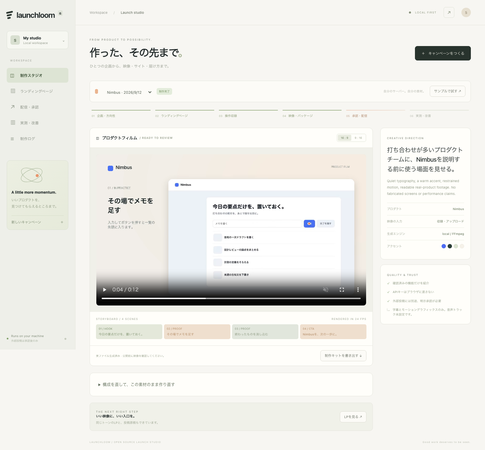

# Launchloom

**作った、その先まで。**

A local-first, open-source launch studio that turns a product brief and real
product footage into a film, a landing page, and reviewable social posts.

**v0.1.1 / single-operator alpha / provisional project name**



Astraを起動しなくても動く、独立したOSSです。企画・LP・実操作の収録・動画編集・
SNSの原稿・承認・配信・計測を、ひとつのキャンペーンとして扱います。
「制作画面だけ」のモックではなく、実際にMP4、HTML、投稿原稿、ZIPを出力します。

## いちばん早い試し方

必要：Python 3.11以降、FFmpeg/ffprobe、Chromium、日英フォント。
検証したバージョンは `requirements-tested.txt` と `docs/VERIFICATION.md` にあります。

```bash
# macOS: FFmpegが未導入の場合
brew install ffmpeg

python3 -m venv .venv
source .venv/bin/activate
python -m pip install -e .
python -m playwright install chromium
cp .env.example .env

# 収録に使うブラウザとフォントが本当に動くか、先に確かめる
python -m launchloom doctor

python -m launchloom serve
```

`doctor` は「パスが存在するか」ではなく、**実際にブラウザを起動して**確認します。
ヘッドレスシェルは通常のChromiumとは別のダウンロードで、パスがあっても起動しないことがあるためです。
日本語フォントが見つからない場合もここで警告します（見つからないまま制作すると豆腐になります）。

`http://127.0.0.1:8787` を開き、起動時にターミナルへ出たローカルアクセスキーで入室。
**「サンプルで試す」** を押してください。AI APIキーやSNSアカウントは不要です。

内蔵の小さなタスクアプリ「Orbit」を実際に操作し、横長・縦長動画、LP、原稿を制作します。
Orbitは実在サービスの実績を装うためのダミーではなく、このリポジトリ内で動くサンプルです。
出力にはサンプル表記が入ります。動画は音声素材未指定なら無音です。

Linuxでは `ffmpeg` と `fonts-noto-cjk` をOSのパッケージマネージャーで導入し、
`python -m playwright install --with-deps chromium` を使用してください。
Windowsではvenvの有効化は `.venv\Scripts\Activate.ps1` です。ffmpeg/ffprobeをPATHへ追加します。
**macOSとDockerは実機で確認済みです。Windowsと実機Linuxデスクトップは未検証です。**

### Smart Camera

自動収録では、クリックのたびにズームイン／ズームアウトする方式を採っていません。
注視点をショットとして保持し、次の重要操作へだけ C2 連続の smootherstep で移動します。
近接した操作は同じショットにまとめ、画面端のクリックも安全領域へ寄せます。

- click: 1.17x / fill: 1.13x / scroll: 1.06x
- transition: 0.82s
- tiny retarget dead-zone: 7.5%
- zoom pulse / spring overshoot: なし

## 自分のプロダクトで作る

画面右上からキャンペーンを作ります。プロダクト名、対象ユーザー、伝えること、公開先URL、
実装済み機能とその根拠を入力します。公開先URLがなくても制作できますが、登録用CTAは無効になります。

操作映像には3つの経路があります。

| 経路 | 内容 |
|---|---|
| ステージングURL | Playwrightがクリック・入力・スクロール・待機を実行。許可したoriginのみ。新規ブラウザコンテキストで、ログインCookieは引き継がない |
| アップロード / 画面収録 | 自分の動画、Screen Studio等で収録したMP4/WebM、デスクトップブラウザの画面共有からの録画を使用 |
| 紹介アニメーション | 操作映像がない場合のモーショングラフィックス。実画面収録ではないことを表示 |

URL収録の例は `examples/browser-capture.json`。`.env` の
`CAPTURE_ALLOWED_ORIGINS` にテスト環境のoriginを明示します。製品のログインや顧客情報を
自動で取り込む機能はありません。認証済み画面は安全なテストデータで手動収録してインポートします。
アップロードは200MB、300秒、各辺4096pxまで。

**素材の使う範囲は指定できます。** 開始位置と長さを秒で指定すると、そこだけが本編になります
（未指定なら先頭から最大20秒）。取り込んだ映像にはカーソル情報がないため、
操作イベント（時刻・座標・ラベル）をJSONで渡すと、自動収録と同じ寄りと画面上のラベルが付きます。

## 作る前に、構成を確かめる


「レンダリング前に、構成と収録内容を確認する」を選ぶと、**収録まで進んだところで制作が止まります。**
この時点では、映像の書き出しも、生成AIへの依頼も、外部への送信も行われていません。

- 収録された画面の1コマと、シーン構成が表示されます
- 見出し・補足・**字幕**を、シーンごとに直せます（字幕は見出しと別の言い回しにできます）
- 承認すると、その文言のままレンダリングされます。企画を作り直して上書きすることはありません

編集は**型付きの差分**として送られます。シーンの役割（hook / proof / cta）と、
どの承認済み機能を指しているかは構造として固定で、編集では動きません。
書き換えた文言は `storyboard.json` と `manifest.json` に `operator-edited` として記録されます。

ビジュアル方向は3種類から選べます。配色替えではなく、地・文字・構造が変わります。

| | |
|---|---|
| **Editorial** | 余白と紙の質感、静かな書体 |
| **Spotlight** | 暗がりに、製品だけが光る |
| **Grid** | 方眼と小さな見出し、硬い輪郭 |

### 1シーンだけ直す

完成したキャンペーンは、**同じ素材のまま作り直せます。** 収録済みの映像をそのまま使い、
再収録も、生成AIへの再依頼も行いません。CTAの言い回しだけを変えて、15秒ほどで再出力できます。
改訂回数は `manifest.json` に残ります。

ブリーフそのもの（機能や主張）を変える場合は、新しいキャンペーンを作ってください。

## 出力

```text
launch-kit.zip
├── campaign.json        公開用の製品情報（根拠メモを除く）
├── storyboard.json      演出・シーン構成
├── landscape.mp4        16:9 / 1280×720 / H.264 / 24fps
├── portrait.mp4         9:16 / 720×1280 / H.264 / 24fps
├── landscape.jpg / portrait.jpg
├── captions.srt         画面上のシーン見出し。音声の文字起こしではない
├── posts.json / social-copy.md
├── qa.json              自動検査と限界・警告
├── manifest.json        ファイルハッシュと素材の出どころ
└── site/
    ├── index.html
    ├── site.css / site.js
    └── film.mp4 / poster.jpg
```

LPは自己完結した静的ファイルです。外部CDNや外部フォントの必須依存はありません。

### LPを公開先へ置く

`SITE_DEPLOY_DIR` に、自分が公開に使っているディレクトリ（静的ホスティングが見ている
フォルダーやリポジトリの作業コピー）を設定すると、LPタブから書き出せます。

書き出す前に、**何をどこへ書くかのプレビュー**が出ます。承認はそのときのファイルの
ハッシュに結び付き、LPを作り直すと無効になります。書き込むのは生成した5ファイルだけで、
そのディレクトリの他のファイルは消しません。

ホスティングのAPI連携（Netlify等）は実装していません。アップロードもDNS設定も行いません。

## SNSへ届ける

**Postizを別のサービスとして連携**します。PostizのOAuth画面で自分のSNSを接続し、
Launchloomのサーバー環境に `POSTIZ_BASE_URL` と `POSTIZ_API_KEY` を設定します。
設定ダイアログに、接続の手順と現在の状態が並びます。

`ENABLE_LIVE_PUBLISH=0` が既定です。原稿の編集・コピー・送信JSONのdry-runは可能ですが、
外部に動画をアップロードしたり投稿したりはしません。

送信までに、独立した2つの承認があります。

1. **キャンペーンの公開可（release）** — 映像が完成したことと、公開してよいことは別の判断です。
   公開可にするまで、どの投稿も送信できません。保留に戻せます。
2. **投稿ごとの承認** — 原稿・メディアハッシュ・投稿先・予約日時・SNS固有設定に結び付きます。

同じSNSへ短時間に積み上がらないよう、間隔（既定30分）と1日あたりの件数（既定3件）の
上限があります。`MIN_POST_GAP_MINUTES` と `MAX_POSTS_PER_CHANNEL_PER_DAY` で変更できます。

### 受け付けられたことと、公開されたことは別

Postizが受け付けた（`submitted`）ことは、SNSで公開された証拠ではありません。
「実状態を確認」を押すと、Postizの `GET /posts` を日付範囲で読み、記録した投稿IDと
突合して、公開済み・待機中・失敗・**見つからない**を表示します。推測では埋めません。

送信中にタイムアウトした場合、状態は `needs_reconciliation` になり、**自動では再送しません。**
タイムアウトは「投稿が作られなかった」証拠ではないからです。「突合する」を押すと、
その期間に同じアカウントで同じ書き出しの投稿を一覧し、制作者が

- 「この投稿として記録する」（PostizのIDを指定）
- 「投稿は作られていない」（承認済みに戻り、必要なら送信し直せる）

のどちらかを選びます。どちらもアプリが勝手に決めることはありません。

対応アダプター：X、LinkedIn、Threads、Bluesky、YouTube、Instagram、TikTok。
ただし接続先Postizの対応、アカウント種別、API権限、各SNSの審査・制約に依存します。
**全SNSの実アカウントで成功確認したという意味ではありません。**
ボットによる大量返信、DM、偽の反応購入、アカウント量産は実装していません。

## 計測

LPの表示とCTAクリックは、`PUBLIC_TRACKING_BASE` を設定した場合にのみ送信されます。

登録などの**確定したコンバージョンは、自分のバックエンドから署名付きで送ります。**
キャンペーンごとの署名鍵は、スタジオのアクセスキーとは別に導出されるので、
バックエンドにスタジオの権限を渡す必要がありません。

```
POST /conversions
X-Launchloom-Signature: sha256=HMAC_SHA256(secret, raw_body)

{"campaign_id":"…","conversion_id":"自分のシステムの一意ID","channel":"x","at":"…"}
```

同じ `conversion_id` は一度しか数えません（リトライで水増しされません）。
`at` を付けた場合は前後5分のみ受け付けます。個人情報は送らないでください。
イベント数は「人数」ではありません。取得できていないSNSのインプレッションは、推計で埋めません。

## 映像生成AIをつなぐ

ローカルのモーショングラフィックスと実画面収録だけなら、AI API料金はかかりません。
コンピューター、電力、ホスティング等のコストまでゼロという意味ではありません。

- **fal**：APIキー、モデルID、公式スキーマに沿った入力JSONを設定。
- **ComfyUI**：自分のサーバーと、信頼できるAPI形式の映像生成ワークフローを指定。
- **LLM**：Chat Completions互換エンドポイントで、企画の演出方針と映像プロンプトを作成。

いずれも必須依存ではありません。モデルを勝手に選択したり、重み・カスタムノードを
自動ダウンロードしたりしません。生成映像はコンセプト部分に使い、実際の製品機能の証拠には使いません。
送信前にUIで外部データ送信への同意が必要です。`docs/INTEGRATIONS.md` を参照してください。

## 構成

```text
Brief → Plan → Site → Capture →〔構成レビュー〕→ Concept film? → Render → QA / Launch kit
                                                                      ↓
                                              Release → Draft → Approval → Postiz → 実状態の突合
                                                                      ↓
                                                        Real metrics → Next brief
```

FastAPI / SQLite / Playwright / Pillow / FFmpeg / HTML+CSS+JavaScript。
フロントエンドのビルド工程や巨大なエージェントフレームワークを必須にしません。
APIによって他の製品から利用でき、Astraは将来の任意クライアントにできます。
詳細は `docs/ARCHITECTURE.md` と `docs/API.md`。

## Docker

```bash
docker compose up -d
docker compose exec studio python -m launchloom doctor   # Browser launch: OK を確認
```

Chromium自身のサンドボックスは有効のままです。Dockerの既定seccompプロファイルは
Chromiumが使うuser namespaceの呼び出しを塞ぐため、Chromium用のプロファイルを同梱し、
`compose.yaml` から指定しています（`docker/chromium-seccomp.json`）。
`--no-sandbox` も `seccomp=unconfined` も必要ありません。

## 検証

```bash
python -m pip install -e '.[dev]'
python -m pytest -q                 # 106 passed
python -m compileall -q launchloom

# 制作後、実ブラウザと実ファイルで確認する
python examples/verify_ui.py --data .launchloom --output checks
python examples/verify_artifacts.py --data .launchloom --output checks
```

`docs/VERIFICATION.md` に、実行環境・結果・**実際に走らせて見つかった不具合**・
未検証の範囲を分けて記録しています。
自動検査の合格は、映像の芸術的完成度、機能主張の独立検証、バズ、売上、
セキュリティ監査を意味しません。

## OSSと事業化

**今回のオリジナル実装はApache-2.0**。Postizやモデル等は別のライセンス・条件です。
`LICENSE` / `NOTICE` / `THIRD_PARTY.md` を確認してください。

OSS版はローカル制作・自分のキー・自分の投稿先を中核に維持。
将来の有料版候補はクラウドレンダリング、ブランド管理、チーム承認、素材管理、
投稿運用、公開・計測をまとめたホスティングです。これらは現版の実装済み機能ではありません。
具体的な次工程と完成条件を `docs/ROADMAP.md` に分けています。

**このalphaを認証付き画面ごとインターネットへ公開して、多人数SaaSとして運用しないでください。**
認証は単一操作者向けです。TLS・テナント分離・実行サンドボックス・ストレージ上限・
課金・監査・外部APIの実接続検証を行うまでは、信頼できるローカル環境に限定します。
