# dependency-map/group-1

[解析トップへ戻る](../../README.md)

このグループは表示用の区切りです。独立した実行モジュールではありません。

```mermaid
graph TD
    n-launchloom-server-py-0b6e3a["server.py\nlaunchloom/server.py"]
    n-launchloom-cli-py-93b636["cli.py\nlaunchloom/cli.py"]
    n-launchloom-models-py-c417bd["models.py\nlaunchloom/models.py"]
    n-launchloom-store-py-46c57a["store.py\nlaunchloom/store.py"]
    n-launchloom-contracts-py-2850d4["contracts.py\nlaunchloom/contracts.py"]
    n-launchloom-pipeline-py-f392fe["pipeline.py\nlaunchloom/pipeline.py"]
    n-launchloom-planning-py-790743["planning.py\nlaunchloom/planning.py"]
    n-launchloom-providers-py-48b2d7["providers.py\nlaunchloom/providers.py"]
```

## 要素の説明

### n-launchloom-cli-py-93b636

確認済みファイル: `launchloom/cli.py`

解析: Python AST。静的なimport／export参照です。関数の実行順序やHTTP通信は表していません。

宣言: `load_env`, `main`

- `__future__` → 外部・標準ライブラリ・別名など。ローカル対応先は未確定
- `argparse` → 外部・標準ライブラリ・別名など。ローカル対応先は未確定
- `os` → 外部・標準ライブラリ・別名など。ローカル対応先は未確定
- `shutil` → 外部・標準ライブラリ・別名など。ローカル対応先は未確定
- `sys` → 外部・標準ライブラリ・別名など。ローカル対応先は未確定
- `time` → 外部・標準ライブラリ・別名など。ローカル対応先は未確定
- `pathlib` → 外部・標準ライブラリ・別名など。ローカル対応先は未確定
- `config` → `launchloom/config.py`（一覧確認・内容未読）
- `server` → `launchloom/server.py`（内容確認済み）
- `uvicorn` → 外部・標準ライブラリ・別名など。ローカル対応先は未確定
- `importlib.metadata` → 外部・標準ライブラリ・別名など。ローカル対応先は未確定
- `capture` → `launchloom/capture.py`（一覧確認・内容未読）
- `rendering` → `launchloom/rendering.py`（内容確認済み）
- `selftest` → `launchloom/selftest.py`（一覧確認・内容未読）
- `httpx` → 外部・標準ライブラリ・別名など。ローカル対応先は未確定

[詳細な図と説明を見る](n-launchloom-cli-py-93b636/README.md)

### n-launchloom-contracts-py-2850d4

確認済みファイル: `launchloom/contracts.py`

解析: Python AST。静的なimport／export参照です。関数の実行順序やHTTP通信は表していません。

宣言: `CampaignRecord`, `CampaignSnapshot`, `BuildJob`, `APIError`

- `typing` → 外部・標準ライブラリ・別名など。ローカル対応先は未確定
- `pydantic` → 外部・標準ライブラリ・別名など。ローカル対応先は未確定
- `models` → `launchloom/models.py`（内容確認済み）

[詳細な図と説明を見る](n-launchloom-contracts-py-2850d4/README.md)

### n-launchloom-models-py-c417bd

確認済みファイル: `launchloom/models.py`

解析: Python AST。静的なimport／export参照です。関数の実行順序やHTTP通信は表していません。

宣言: `StrictModel`, `Feature`, `CaptureStep`, `CaptureEvent`, `Brief`, `BuildOptions`, `Scene`, `Plan`, `SceneEdit`, `PlanEdit`, `PublicationDraft`, `Reconciliation`, `Approval`

- `__future__` → 外部・標準ライブラリ・別名など。ローカル対応先は未確定
- `re` → 外部・標準ライブラリ・別名など。ローカル対応先は未確定
- `typing` → 外部・標準ライブラリ・別名など。ローカル対応先は未確定
- `urllib.parse` → 外部・標準ライブラリ・別名など。ローカル対応先は未確定
- `pydantic` → 外部・標準ライブラリ・別名など。ローカル対応先は未確定

[詳細な図と説明を見る](n-launchloom-models-py-c417bd/README.md)

### n-launchloom-pipeline-py-f392fe

確認済みファイル: `launchloom/pipeline.py`

解析: Python AST。静的なimport／export参照です。関数の実行順序やHTTP通信は表していません。

宣言: `write_json`, `review_still`, `srt_time`, `build`, `worker_loop`

- `__future__` → 外部・標準ライブラリ・別名など。ローカル対応先は未確定
- `asyncio` → 外部・標準ライブラリ・別名など。ローカル対応先は未確定
- `json` → 外部・標準ライブラリ・別名など。ローカル対応先は未確定
- `shutil` → 外部・標準ライブラリ・別名など。ローカル対応先は未確定
- `zipfile` → 外部・標準ライブラリ・別名など。ローカル対応先は未確定
- `pathlib` → 外部・標準ライブラリ・別名など。ローカル対応先は未確定
- `PIL` → 外部・標準ライブラリ・別名など。ローカル対応先は未確定
- `__version__` → 外部・標準ライブラリ・別名など。ローカル対応先は未確定
- `config` → `launchloom/config.py`（一覧確認・内容未読）
- `models` → `launchloom/models.py`（内容確認済み）
- `store` → `launchloom/store.py`（内容確認済み）
- `planning` → `launchloom/planning.py`（内容確認済み）
- `providers` → `launchloom/providers.py`（内容確認済み）
- `capture` → `launchloom/capture.py`（一覧確認・内容未読）
- `rendering` → `launchloom/rendering.py`（内容確認済み）
- `site` → `launchloom/site.py`（一覧確認・内容未読）
- `security` → `launchloom/security.py`（内容確認済み）
- `claims` → `launchloom/claims.py`（一覧確認・内容未読）

[詳細な図と説明を見る](n-launchloom-pipeline-py-f392fe/README.md)

### n-launchloom-planning-py-790743

確認済みファイル: `launchloom/planning.py`

解析: Python AST。静的なimport／export参照です。関数の実行順序やHTTP通信は表していません。

宣言: `make_plan`, `with_utm`, `x_weight`, `make_posts`, `apply_plan_edit`

- `__future__` → 外部・標準ライブラリ・別名など。ローカル対応先は未確定
- `re` → 外部・標準ライブラリ・別名など。ローカル対応先は未確定
- `urllib.parse` → 外部・標準ライブラリ・別名など。ローカル対応先は未確定
- `models` → `launchloom/models.py`（内容確認済み）
- `rendering` → `launchloom/rendering.py`（内容確認済み）
- `post_copy` → `launchloom/post_copy.py`（一覧確認・内容未読）

[詳細な図と説明を見る](n-launchloom-planning-py-790743/README.md)

### n-launchloom-providers-py-48b2d7

確認済みファイル: `launchloom/providers.py`

解析: Python AST。静的なimport／export参照です。関数の実行順序やHTTP通信は表していません。

宣言: `FilmProvider`, `Publisher`, `llm_plan`, `download_public_media`, `FalFilm`, `ComfyFilm`, `receipt_ids`, `match_remote`, `remote_candidates`, `validate_publication`, `PostizPublisher`

- `__future__` → 外部・標準ライブラリ・別名など。ローカル対応先は未確定
- `asyncio` → 外部・標準ライブラリ・別名など。ローカル対応先は未確定
- `ipaddress` → 外部・標準ライブラリ・別名など。ローカル対応先は未確定
- `json` → 外部・標準ライブラリ・別名など。ローカル対応先は未確定
- `socket` → 外部・標準ライブラリ・別名など。ローカル対応先は未確定
- `datetime` → 外部・標準ライブラリ・別名など。ローカル対応先は未確定
- `pathlib` → 外部・標準ライブラリ・別名など。ローカル対応先は未確定
- `urllib.parse` → 外部・標準ライブラリ・別名など。ローカル対応先は未確定
- `typing` → 外部・標準ライブラリ・別名など。ローカル対応先は未確定
- `httpx` → 外部・標準ライブラリ・別名など。ローカル対応先は未確定
- `config` → `launchloom/config.py`（一覧確認・内容未読）
- `models` → `launchloom/models.py`（内容確認済み）
- `planning` → `launchloom/planning.py`（内容確認済み）
- `security` → `launchloom/security.py`（内容確認済み）
- `store` → `launchloom/store.py`（内容確認済み）
- `rendering` → `launchloom/rendering.py`（内容確認済み）

[詳細な図と説明を見る](n-launchloom-providers-py-48b2d7/README.md)

### n-launchloom-server-py-0b6e3a

確認済みファイル: `launchloom/server.py`

解析: Python AST。静的なimport／export参照です。関数の実行順序やHTTP通信は表していません。

宣言: `create_app`

- `__future__` → 外部・標準ライブラリ・別名など。ローカル対応先は未確定
- `asyncio` → 外部・標準ライブラリ・別名など。ローカル対応先は未確定
- `contextlib` → 外部・標準ライブラリ・別名など。ローカル対応先は未確定
- `hmac` → 外部・標準ライブラリ・別名など。ローカル対応先は未確定
- `json` → 外部・標準ライブラリ・別名など。ローカル対応先は未確定
- `os` → 外部・標準ライブラリ・別名など。ローカル対応先は未確定
- `secrets` → 外部・標準ライブラリ・別名など。ローカル対応先は未確定
- `time` → 外部・標準ライブラリ・別名など。ローカル対応先は未確定
- `collections` → 外部・標準ライブラリ・別名など。ローカル対応先は未確定
- `pathlib` → 外部・標準ライブラリ・別名など。ローカル対応先は未確定
- `datetime` → 外部・標準ライブラリ・別名など。ローカル対応先は未確定
- `urllib.parse` → 外部・標準ライブラリ・別名など。ローカル対応先は未確定
- `fastapi` → 外部・標準ライブラリ・別名など。ローカル対応先は未確定
- `fastapi.responses` → 外部・標準ライブラリ・別名など。ローカル対応先は未確定
- `fastapi.staticfiles` → 外部・標準ライブラリ・別名など。ローカル対応先は未確定
- `starlette.middleware.trustedhost` → 外部・標準ライブラリ・別名など。ローカル対応先は未確定
- `__version__` → 外部・標準ライブラリ・別名など。ローカル対応先は未確定
- `config` → `launchloom/config.py`（一覧確認・内容未読）
- `models` → `launchloom/models.py`（内容確認済み）
- `store` → `launchloom/store.py`（内容確認済み）
- `contracts` → `launchloom/contracts.py`（内容確認済み）
- `pipeline` → `launchloom/pipeline.py`（内容確認済み）
- `planning` → `launchloom/planning.py`（内容確認済み）
- `providers` → `launchloom/providers.py`（内容確認済み）
- `security` → `launchloom/security.py`（内容確認済み）
- `rendering` → `launchloom/rendering.py`（内容確認済み）
- `deploy` → `launchloom/deploy.py`（内容確認済み）
- `finished_films` → `launchloom/finished_films.py`（内容確認済み）
- `production_api` → `launchloom/production_api.py`（内容確認済み）
- `production_execution` → `launchloom/production_execution.py`（内容確認済み）

[詳細な図と説明を見る](n-launchloom-server-py-0b6e3a/README.md)

### n-launchloom-store-py-46c57a

確認済みファイル: `launchloom/store.py`

解析: Python AST。静的なimport／export参照です。関数の実行順序やHTTP通信は表していません。

宣言: `CreationConflict`, `Store`

- `__future__` → 外部・標準ライブラリ・別名など。ローカル対応先は未確定
- `json` → 外部・標準ライブラリ・別名など。ローカル対応先は未確定
- `re` → 外部・標準ライブラリ・別名など。ローカル対応先は未確定
- `sqlite3` → 外部・標準ライブラリ・別名など。ローカル対応先は未確定
- `time` → 外部・標準ライブラリ・別名など。ローカル対応先は未確定
- `uuid` → 外部・標準ライブラリ・別名など。ローカル対応先は未確定
- `contextlib` → 外部・標準ライブラリ・別名など。ローカル対応先は未確定
- `pathlib` → 外部・標準ライブラリ・別名など。ローカル対応先は未確定
- `security` → `launchloom/security.py`（内容確認済み）

[詳細な図と説明を見る](n-launchloom-store-py-46c57a/README.md)

