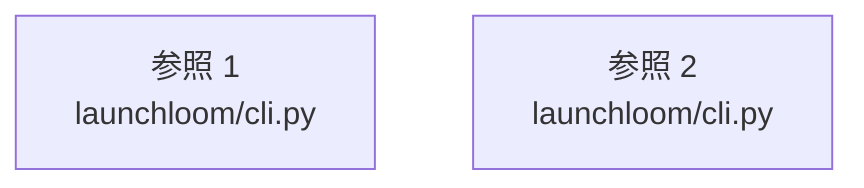

# dependency-map/group-1/n-launchloom-cli-py-93b636

[解析トップへ戻る](../../../README.md)

確認済みファイル: `launchloom/cli.py`

解析: Python AST。静的なimport／export参照です。関数の実行順序やHTTP通信は表していません。

宣言: `load_env`, `main`

- `__future__` → 外部・標準ライブラリ・別名など。ローカル対応先は未確定
- `argparse` → 外部・標準ライブラリ・別名など。ローカル対応先は未確定
- `os` → 外部・標準ライブラリ・別名など。ローカル対応先は未確定
- `shutil` → 外部・標準ライブラリ・別名など。ローカル対応先は未確定
- `sys` → 外部・標準ライブラリ・別名など。ローカル対応先は未確定
- `time` → 外部・標準ライブラリ・別名など。ローカル対応先は未確定
- `pathlib` → 外部・標準ライブラリ・別名など。ローカル対応先は未確定
- `config` → `launchloom/config.py`（一覧確認・内容未読）
- `server` → `launchloom/server.py`（内容確認済み）
- `uvicorn` → 外部・標準ライブラリ・別名など。ローカル対応先は未確定
- `importlib.metadata` → 外部・標準ライブラリ・別名など。ローカル対応先は未確定
- `capture` → `launchloom/capture.py`（一覧確認・内容未読）
- `rendering` → `launchloom/rendering.py`（内容確認済み）
- `selftest` → `launchloom/selftest.py`（一覧確認・内容未読）
- `httpx` → 外部・標準ライブラリ・別名など。ローカル対応先は未確定

## 要素の説明

### imports-1

import参照の表示用グループ。

[詳細な図と説明を見る](imports-1/README.md)

### imports-2

import参照の表示用グループ。

[詳細な図と説明を見る](imports-2/README.md)

