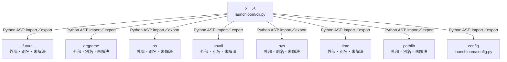

# dependency-map/group-1/n-launchloom-cli-py-93b636/imports-1

[解析トップへ戻る](../../../../README.md)

import参照の表示用グループ。

## 要素の説明

### n-argparse-e750ee

参照名: `argparse`

ローカルのソース対応先を確定できませんでした。外部ライブラリ、標準ライブラリ、型別名などを区別する追加確認が必要です。

### n-config-dfba7a

参照名: `config`

対応する実在ソース: `launchloom/config.py`。内容は未読。

### n-future-05a733

参照名: `__future__`

ローカルのソース対応先を確定できませんでした。外部ライブラリ、標準ライブラリ、型別名などを区別する追加確認が必要です。

### n-os-999a34

参照名: `os`

ローカルのソース対応先を確定できませんでした。外部ライブラリ、標準ライブラリ、型別名などを区別する追加確認が必要です。

### n-pathlib-4471f7

参照名: `pathlib`

ローカルのソース対応先を確定できませんでした。外部ライブラリ、標準ライブラリ、型別名などを区別する追加確認が必要です。

### n-shutil-748708

参照名: `shutil`

ローカルのソース対応先を確定できませんでした。外部ライブラリ、標準ライブラリ、型別名などを区別する追加確認が必要です。

### n-sys-b4c56e

参照名: `sys`

ローカルのソース対応先を確定できませんでした。外部ライブラリ、標準ライブラリ、型別名などを区別する追加確認が必要です。

### n-time-714eea

参照名: `time`

ローカルのソース対応先を確定できませんでした。外部ライブラリ、標準ライブラリ、型別名などを区別する追加確認が必要です。

### source

`launchloom/cli.py` の内容を確認しました。

