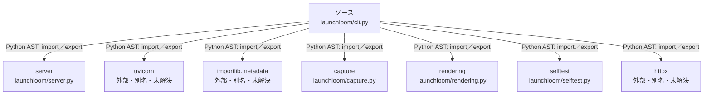

# dependency-map/group-1/n-launchloom-cli-py-93b636/imports-2

[解析トップへ戻る](../../../../README.md)

import参照の表示用グループ。

## 要素の説明

### n-capture-fbc259

参照名: `capture`

対応する実在ソース: `launchloom/capture.py`。内容は未読。

### n-httpx-f79177

参照名: `httpx`

ローカルのソース対応先を確定できませんでした。外部ライブラリ、標準ライブラリ、型別名などを区別する追加確認が必要です。

### n-importlib-metadata-9cd288

参照名: `importlib.metadata`

ローカルのソース対応先を確定できませんでした。外部ライブラリ、標準ライブラリ、型別名などを区別する追加確認が必要です。

### n-rendering-043dd9

参照名: `rendering`

対応する実在ソース: `launchloom/rendering.py`。内容確認済み。

### n-selftest-90d040

参照名: `selftest`

対応する実在ソース: `launchloom/selftest.py`。内容は未読。

### n-server-3de4f9

参照名: `server`

対応する実在ソース: `launchloom/server.py`。内容確認済み。

### n-uvicorn-c0aa57

参照名: `uvicorn`

ローカルのソース対応先を確定できませんでした。外部ライブラリ、標準ライブラリ、型別名などを区別する追加確認が必要です。

### source

`launchloom/cli.py` の内容を確認しました。

