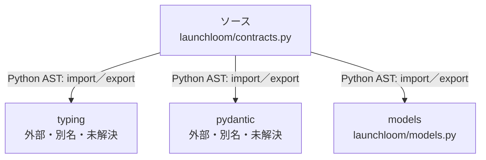

# dependency-map/group-1/n-launchloom-contracts-py-2850d4

[解析トップへ戻る](../../../README.md)

確認済みファイル: `launchloom/contracts.py`

解析: Python AST。静的なimport／export参照です。関数の実行順序やHTTP通信は表していません。

宣言: `CampaignRecord`, `CampaignSnapshot`, `BuildJob`, `APIError`

- `typing` → 外部・標準ライブラリ・別名など。ローカル対応先は未確定
- `pydantic` → 外部・標準ライブラリ・別名など。ローカル対応先は未確定
- `models` → `launchloom/models.py`（内容確認済み）

## 要素の説明

### n-models-5ba268

参照名: `models`

対応する実在ソース: `launchloom/models.py`。内容確認済み。

### n-pydantic-196fee

参照名: `pydantic`

ローカルのソース対応先を確定できませんでした。外部ライブラリ、標準ライブラリ、型別名などを区別する追加確認が必要です。

### n-typing-02d7d3

参照名: `typing`

ローカルのソース対応先を確定できませんでした。外部ライブラリ、標準ライブラリ、型別名などを区別する追加確認が必要です。

### source

`launchloom/contracts.py` の内容を確認しました。

