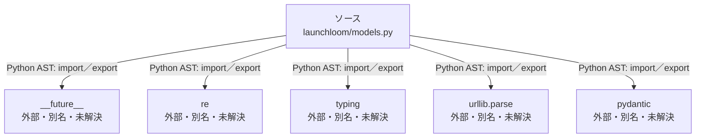

# dependency-map/group-1/n-launchloom-models-py-c417bd

[解析トップへ戻る](../../../README.md)

確認済みファイル: `launchloom/models.py`

解析: Python AST。静的なimport／export参照です。関数の実行順序やHTTP通信は表していません。

宣言: `StrictModel`, `Feature`, `CaptureStep`, `CaptureEvent`, `Brief`, `BuildOptions`, `Scene`, `Plan`, `SceneEdit`, `PlanEdit`, `PublicationDraft`, `Reconciliation`, `Approval`

- `__future__` → 外部・標準ライブラリ・別名など。ローカル対応先は未確定
- `re` → 外部・標準ライブラリ・別名など。ローカル対応先は未確定
- `typing` → 外部・標準ライブラリ・別名など。ローカル対応先は未確定
- `urllib.parse` → 外部・標準ライブラリ・別名など。ローカル対応先は未確定
- `pydantic` → 外部・標準ライブラリ・別名など。ローカル対応先は未確定

## 要素の説明

### n-future-05a733

参照名: `__future__`

ローカルのソース対応先を確定できませんでした。外部ライブラリ、標準ライブラリ、型別名などを区別する追加確認が必要です。

### n-pydantic-196fee

参照名: `pydantic`

ローカルのソース対応先を確定できませんでした。外部ライブラリ、標準ライブラリ、型別名などを区別する追加確認が必要です。

### n-re-c387c9

参照名: `re`

ローカルのソース対応先を確定できませんでした。外部ライブラリ、標準ライブラリ、型別名などを区別する追加確認が必要です。

### n-typing-02d7d3

参照名: `typing`

ローカルのソース対応先を確定できませんでした。外部ライブラリ、標準ライブラリ、型別名などを区別する追加確認が必要です。

### n-urllib-parse-ab9b2d

参照名: `urllib.parse`

ローカルのソース対応先を確定できませんでした。外部ライブラリ、標準ライブラリ、型別名などを区別する追加確認が必要です。

### source

`launchloom/models.py` の内容を確認しました。

