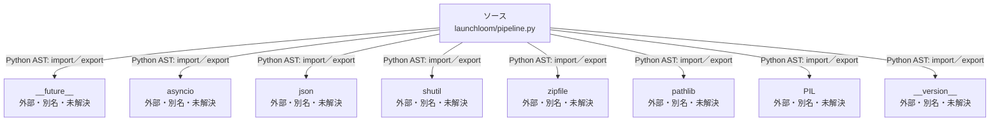

# dependency-map/group-1/n-launchloom-pipeline-py-f392fe/imports-1

[解析トップへ戻る](../../../../README.md)

import参照の表示用グループ。

## 要素の説明

### n-asyncio-4f5a0f

参照名: `asyncio`

ローカルのソース対応先を確定できませんでした。外部ライブラリ、標準ライブラリ、型別名などを区別する追加確認が必要です。

### n-future-05a733

参照名: `__future__`

ローカルのソース対応先を確定できませんでした。外部ライブラリ、標準ライブラリ、型別名などを区別する追加確認が必要です。

### n-json-05d97e

参照名: `json`

ローカルのソース対応先を確定できませんでした。外部ライブラリ、標準ライブラリ、型別名などを区別する追加確認が必要です。

### n-pathlib-4471f7

参照名: `pathlib`

ローカルのソース対応先を確定できませんでした。外部ライブラリ、標準ライブラリ、型別名などを区別する追加確認が必要です。

### n-pil-ad9e69

参照名: `PIL`

ローカルのソース対応先を確定できませんでした。外部ライブラリ、標準ライブラリ、型別名などを区別する追加確認が必要です。

### n-shutil-748708

参照名: `shutil`

ローカルのソース対応先を確定できませんでした。外部ライブラリ、標準ライブラリ、型別名などを区別する追加確認が必要です。

### n-version-8c86bc

参照名: `__version__`

ローカルのソース対応先を確定できませんでした。外部ライブラリ、標準ライブラリ、型別名などを区別する追加確認が必要です。

### n-zipfile-fabc0a

参照名: `zipfile`

ローカルのソース対応先を確定できませんでした。外部ライブラリ、標準ライブラリ、型別名などを区別する追加確認が必要です。

### source

`launchloom/pipeline.py` の内容を確認しました。

