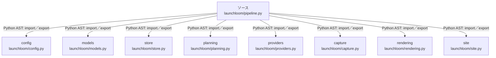

# dependency-map/group-1/n-launchloom-pipeline-py-f392fe/imports-2

[解析トップへ戻る](../../../../README.md)

import参照の表示用グループ。

## 要素の説明

### n-capture-fbc259

参照名: `capture`

対応する実在ソース: `launchloom/capture.py`。内容は未読。

### n-config-dfba7a

参照名: `config`

対応する実在ソース: `launchloom/config.py`。内容は未読。

### n-models-5ba268

参照名: `models`

対応する実在ソース: `launchloom/models.py`。内容確認済み。

### n-planning-bdf5c7

参照名: `planning`

対応する実在ソース: `launchloom/planning.py`。内容確認済み。

### n-providers-d7e351

参照名: `providers`

対応する実在ソース: `launchloom/providers.py`。内容確認済み。

### n-rendering-043dd9

参照名: `rendering`

対応する実在ソース: `launchloom/rendering.py`。内容確認済み。

### n-site-c099a4

参照名: `site`

対応する実在ソース: `launchloom/site.py`。内容は未読。

### n-store-3a2129

参照名: `store`

対応する実在ソース: `launchloom/store.py`。内容確認済み。

### source

`launchloom/pipeline.py` の内容を確認しました。

