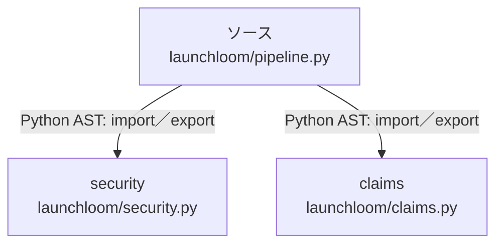

# dependency-map/group-1/n-launchloom-pipeline-py-f392fe/imports-3

[解析トップへ戻る](../../../../README.md)

import参照の表示用グループ。

## 要素の説明

### n-claims-d72041

参照名: `claims`

対応する実在ソース: `launchloom/claims.py`。内容は未読。

### n-security-8eec7b

参照名: `security`

対応する実在ソース: `launchloom/security.py`。内容確認済み。

### source

`launchloom/pipeline.py` の内容を確認しました。

