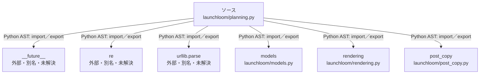

# dependency-map/group-1/n-launchloom-planning-py-790743

[解析トップへ戻る](../../../README.md)

確認済みファイル: `launchloom/planning.py`

解析: Python AST。静的なimport／export参照です。関数の実行順序やHTTP通信は表していません。

宣言: `make_plan`, `with_utm`, `x_weight`, `make_posts`, `apply_plan_edit`

- `__future__` → 外部・標準ライブラリ・別名など。ローカル対応先は未確定
- `re` → 外部・標準ライブラリ・別名など。ローカル対応先は未確定
- `urllib.parse` → 外部・標準ライブラリ・別名など。ローカル対応先は未確定
- `models` → `launchloom/models.py`（内容確認済み）
- `rendering` → `launchloom/rendering.py`（内容確認済み）
- `post_copy` → `launchloom/post_copy.py`（一覧確認・内容未読）

## 要素の説明

### n-future-05a733

参照名: `__future__`

ローカルのソース対応先を確定できませんでした。外部ライブラリ、標準ライブラリ、型別名などを区別する追加確認が必要です。

### n-models-5ba268

参照名: `models`

対応する実在ソース: `launchloom/models.py`。内容確認済み。

### n-post-copy-fa51df

参照名: `post_copy`

対応する実在ソース: `launchloom/post_copy.py`。内容は未読。

### n-re-c387c9

参照名: `re`

ローカルのソース対応先を確定できませんでした。外部ライブラリ、標準ライブラリ、型別名などを区別する追加確認が必要です。

### n-rendering-043dd9

参照名: `rendering`

対応する実在ソース: `launchloom/rendering.py`。内容確認済み。

### n-urllib-parse-ab9b2d

参照名: `urllib.parse`

ローカルのソース対応先を確定できませんでした。外部ライブラリ、標準ライブラリ、型別名などを区別する追加確認が必要です。

### source

`launchloom/planning.py` の内容を確認しました。

