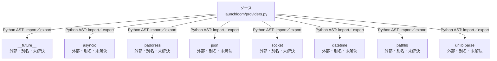

# dependency-map/group-1/n-launchloom-providers-py-48b2d7/imports-1

[解析トップへ戻る](../../../../README.md)

import参照の表示用グループ。

## 要素の説明

### n-asyncio-4f5a0f

参照名: `asyncio`

ローカルのソース対応先を確定できませんでした。外部ライブラリ、標準ライブラリ、型別名などを区別する追加確認が必要です。

### n-datetime-89ffad

参照名: `datetime`

ローカルのソース対応先を確定できませんでした。外部ライブラリ、標準ライブラリ、型別名などを区別する追加確認が必要です。

### n-future-05a733

参照名: `__future__`

ローカルのソース対応先を確定できませんでした。外部ライブラリ、標準ライブラリ、型別名などを区別する追加確認が必要です。

### n-ipaddress-1f99aa

参照名: `ipaddress`

ローカルのソース対応先を確定できませんでした。外部ライブラリ、標準ライブラリ、型別名などを区別する追加確認が必要です。

### n-json-05d97e

参照名: `json`

ローカルのソース対応先を確定できませんでした。外部ライブラリ、標準ライブラリ、型別名などを区別する追加確認が必要です。

### n-pathlib-4471f7

参照名: `pathlib`

ローカルのソース対応先を確定できませんでした。外部ライブラリ、標準ライブラリ、型別名などを区別する追加確認が必要です。

### n-socket-897d21

参照名: `socket`

ローカルのソース対応先を確定できませんでした。外部ライブラリ、標準ライブラリ、型別名などを区別する追加確認が必要です。

### n-urllib-parse-ab9b2d

参照名: `urllib.parse`

ローカルのソース対応先を確定できませんでした。外部ライブラリ、標準ライブラリ、型別名などを区別する追加確認が必要です。

### source

`launchloom/providers.py` の内容を確認しました。

