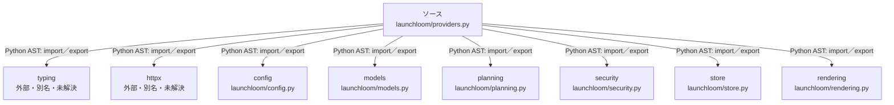

# dependency-map/group-1/n-launchloom-providers-py-48b2d7/imports-2

[解析トップへ戻る](../../../../README.md)

import参照の表示用グループ。

## 要素の説明

### n-config-dfba7a

参照名: `config`

対応する実在ソース: `launchloom/config.py`。内容は未読。

### n-httpx-f79177

参照名: `httpx`

ローカルのソース対応先を確定できませんでした。外部ライブラリ、標準ライブラリ、型別名などを区別する追加確認が必要です。

### n-models-5ba268

参照名: `models`

対応する実在ソース: `launchloom/models.py`。内容確認済み。

### n-planning-bdf5c7

参照名: `planning`

対応する実在ソース: `launchloom/planning.py`。内容確認済み。

### n-rendering-043dd9

参照名: `rendering`

対応する実在ソース: `launchloom/rendering.py`。内容確認済み。

### n-security-8eec7b

参照名: `security`

対応する実在ソース: `launchloom/security.py`。内容確認済み。

### n-store-3a2129

参照名: `store`

対応する実在ソース: `launchloom/store.py`。内容確認済み。

### n-typing-02d7d3

参照名: `typing`

ローカルのソース対応先を確定できませんでした。外部ライブラリ、標準ライブラリ、型別名などを区別する追加確認が必要です。

### source

`launchloom/providers.py` の内容を確認しました。

