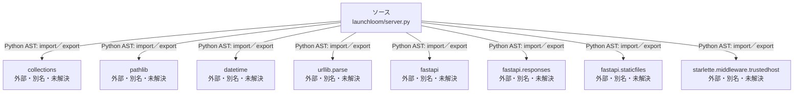

# dependency-map/group-1/n-launchloom-server-py-0b6e3a/imports-2

[解析トップへ戻る](../../../../README.md)

import参照の表示用グループ。

## 要素の説明

### n-collections-fa4b9d

参照名: `collections`

ローカルのソース対応先を確定できませんでした。外部ライブラリ、標準ライブラリ、型別名などを区別する追加確認が必要です。

### n-datetime-89ffad

参照名: `datetime`

ローカルのソース対応先を確定できませんでした。外部ライブラリ、標準ライブラリ、型別名などを区別する追加確認が必要です。

### n-fastapi-41a137

参照名: `fastapi`

ローカルのソース対応先を確定できませんでした。外部ライブラリ、標準ライブラリ、型別名などを区別する追加確認が必要です。

### n-fastapi-responses-2e83fb

参照名: `fastapi.responses`

ローカルのソース対応先を確定できませんでした。外部ライブラリ、標準ライブラリ、型別名などを区別する追加確認が必要です。

### n-fastapi-staticfiles-4f0832

参照名: `fastapi.staticfiles`

ローカルのソース対応先を確定できませんでした。外部ライブラリ、標準ライブラリ、型別名などを区別する追加確認が必要です。

### n-pathlib-4471f7

参照名: `pathlib`

ローカルのソース対応先を確定できませんでした。外部ライブラリ、標準ライブラリ、型別名などを区別する追加確認が必要です。

### n-starlette-middleware-trustedhost-32883e

参照名: `starlette.middleware.trustedhost`

ローカルのソース対応先を確定できませんでした。外部ライブラリ、標準ライブラリ、型別名などを区別する追加確認が必要です。

### n-urllib-parse-ab9b2d

参照名: `urllib.parse`

ローカルのソース対応先を確定できませんでした。外部ライブラリ、標準ライブラリ、型別名などを区別する追加確認が必要です。

### source

`launchloom/server.py` の内容を確認しました。

