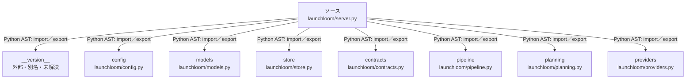

# dependency-map/group-1/n-launchloom-server-py-0b6e3a/imports-3

[解析トップへ戻る](../../../../README.md)

import参照の表示用グループ。

## 要素の説明

### n-config-dfba7a

参照名: `config`

対応する実在ソース: `launchloom/config.py`。内容は未読。

### n-contracts-80cff8

参照名: `contracts`

対応する実在ソース: `launchloom/contracts.py`。内容確認済み。

### n-models-5ba268

参照名: `models`

対応する実在ソース: `launchloom/models.py`。内容確認済み。

### n-pipeline-992b5d

参照名: `pipeline`

対応する実在ソース: `launchloom/pipeline.py`。内容確認済み。

### n-planning-bdf5c7

参照名: `planning`

対応する実在ソース: `launchloom/planning.py`。内容確認済み。

### n-providers-d7e351

参照名: `providers`

対応する実在ソース: `launchloom/providers.py`。内容確認済み。

### n-store-3a2129

参照名: `store`

対応する実在ソース: `launchloom/store.py`。内容確認済み。

### n-version-8c86bc

参照名: `__version__`

ローカルのソース対応先を確定できませんでした。外部ライブラリ、標準ライブラリ、型別名などを区別する追加確認が必要です。

### source

`launchloom/server.py` の内容を確認しました。

