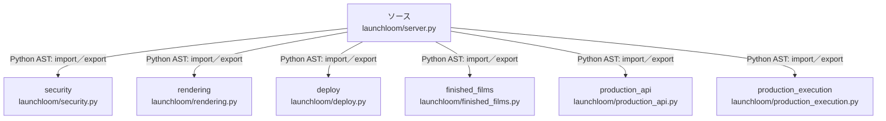

# dependency-map/group-1/n-launchloom-server-py-0b6e3a/imports-4

[解析トップへ戻る](../../../../README.md)

import参照の表示用グループ。

## 要素の説明

### n-deploy-b0d51b

参照名: `deploy`

対応する実在ソース: `launchloom/deploy.py`。内容確認済み。

### n-finished-films-90dfba

参照名: `finished_films`

対応する実在ソース: `launchloom/finished_films.py`。内容確認済み。

### n-production-api-b97ebc

参照名: `production_api`

対応する実在ソース: `launchloom/production_api.py`。内容確認済み。

### n-production-execution-5884d0

参照名: `production_execution`

対応する実在ソース: `launchloom/production_execution.py`。内容確認済み。

### n-rendering-043dd9

参照名: `rendering`

対応する実在ソース: `launchloom/rendering.py`。内容確認済み。

### n-security-8eec7b

参照名: `security`

対応する実在ソース: `launchloom/security.py`。内容確認済み。

### source

`launchloom/server.py` の内容を確認しました。

