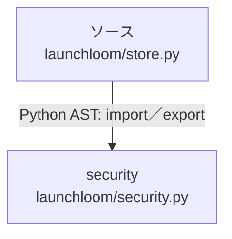

# dependency-map/group-1/n-launchloom-store-py-46c57a/imports-2

[解析トップへ戻る](../../../../README.md)

import参照の表示用グループ。

## 要素の説明

### n-security-8eec7b

参照名: `security`

対応する実在ソース: `launchloom/security.py`。内容確認済み。

### source

`launchloom/store.py` の内容を確認しました。

