# dependency-map/group-2

[解析トップへ戻る](../../README.md)

このグループは表示用の区切りです。独立した実行モジュールではありません。

```mermaid
graph TD
    n-launchloom-security-py-09e4d6["security.py\nlaunchloom/security.py"]
    n-launchloom-rendering-py-a6f2ae["rendering.py\nlaunchloom/rendering.py"]
    n-launchloom-deploy-py-31509e["deploy.py\nlaunchloom/deploy.py"]
    n-launchloom-finished-films-py-3c20e3["finished_films.py\nlaunchloom/finished_films.py"]
    n-launchloom-production-api-py-68c981["production_api.py\nlaunchloom/production_api.py"]
    n-launchloom-production-execution-py-c843c5["production_execution.py\nlaunchloom/production_execution.py"]
```

## 要素の説明

### n-launchloom-deploy-py-31509e

確認済みファイル: `launchloom/deploy.py`

解析: Python AST。静的なimport／export参照です。関数の実行順序やHTTP通信は表していません。

宣言: `resolve_target`, `plan`, `publish`

- `__future__` → 外部・標準ライブラリ・別名など。ローカル対応先は未確定
- `os` → 外部・標準ライブラリ・別名など。ローカル対応先は未確定
- `shutil` → 外部・標準ライブラリ・別名など。ローカル対応先は未確定
- `pathlib` → 外部・標準ライブラリ・別名など。ローカル対応先は未確定
- `config` → `launchloom/config.py`（一覧確認・内容未読）
- `security` → `launchloom/security.py`（内容確認済み）

[詳細な図と説明を見る](n-launchloom-deploy-py-31509e/README.md)

### n-launchloom-finished-films-py-3c20e3

確認済みファイル: `launchloom/finished_films.py`

解析: Python AST。静的なimport／export参照です。関数の実行順序やHTTP通信は表していません。

宣言: `initialize`, `list_films`, `find_film`, `final_path`, `checked_film`, `prepare_file`, `register_prepared_final`, `register_finished_routes`

- `__future__` → 外部・標準ライブラリ・別名など。ローカル対応先は未確定
- `asyncio` → 外部・標準ライブラリ・別名など。ローカル対応先は未確定
- `re` → 外部・標準ライブラリ・別名など。ローカル対応先は未確定
- `secrets` → 外部・標準ライブラリ・別名など。ローカル対応先は未確定
- `time` → 外部・標準ライブラリ・別名など。ローカル対応先は未確定
- `pathlib` → 外部・標準ライブラリ・別名など。ローカル対応先は未確定
- `fastapi` → 外部・標準ライブラリ・別名など。ローカル対応先は未確定
- `models` → `launchloom/models.py`（内容確認済み）
- `rendering` → `launchloom/rendering.py`（内容確認済み）
- `security` → `launchloom/security.py`（内容確認済み）

[詳細な図と説明を見る](n-launchloom-finished-films-py-3c20e3/README.md)

### n-launchloom-production-api-py-68c981

確認済みファイル: `launchloom/production_api.py`

解析: Python AST。静的なimport／export参照です。関数の実行順序やHTTP通信は表していません。

宣言: `register_production_routes`

- `__future__` → 外部・標準ライブラリ・別名など。ローカル対応先は未確定
- `json` → 外部・標準ライブラリ・別名など。ローカル対応先は未確定
- `os` → 外部・標準ライブラリ・別名など。ローカル対応先は未確定
- `tempfile` → 外部・標準ライブラリ・別名など。ローカル対応先は未確定
- `threading` → 外部・標準ライブラリ・別名など。ローカル対応先は未確定
- `pathlib` → 外部・標準ライブラリ・別名など。ローカル対応先は未確定
- `fastapi` → 外部・標準ライブラリ・別名など。ローカル対応先は未確定
- `fastapi.responses` → 外部・標準ライブラリ・別名など。ローカル対応先は未確定
- `production` → `launchloom/production.py`（一覧確認・内容未読）
- `creative_api` → `launchloom/creative_api.py`（一覧確認・内容未読）
- `re` → 外部・標準ライブラリ・別名など。ローカル対応先は未確定

[詳細な図と説明を見る](n-launchloom-production-api-py-68c981/README.md)

### n-launchloom-production-execution-py-c843c5

確認済みファイル: `launchloom/production_execution.py`

解析: Python AST。静的なimport／export参照です。関数の実行順序やHTTP通信は表していません。

宣言: `seedance_estimate_usd`, `_campaign_root`, `_load_production`, `_scene`, `_assert_revision`, `_workspace`, `_atomic_text`, `_agent_task`, `prepare_workspace`, `_state_path`, `_read_state`, `_write_state`, `_media_facts`, `_record_scene`, `checked_scene_asset`, `validate_agent_jsx`, `_minimal_env`, `run_command`, `agent_command`, `run_agent`, `Seedance25`, `_all_required_assets`, `run_after_effects_project`, `_transcode_master`, `run_after_effects_render`

- `__future__` → 外部・標準ライブラリ・別名など。ローカル対応先は未確定
- `asyncio` → 外部・標準ライブラリ・別名など。ローカル対応先は未確定
- `json` → 外部・標準ライブラリ・別名など。ローカル対応先は未確定
- `os` → 外部・標準ライブラリ・別名など。ローカル対応先は未確定
- `platform` → 外部・標準ライブラリ・別名など。ローカル対応先は未確定
- `re` → 外部・標準ライブラリ・別名など。ローカル対応先は未確定
- `secrets` → 外部・標準ライブラリ・別名など。ローカル対応先は未確定
- `shutil` → 外部・標準ライブラリ・別名など。ローカル対応先は未確定
- `subprocess` → 外部・標準ライブラリ・別名など。ローカル対応先は未確定
- `tempfile` → 外部・標準ライブラリ・別名など。ローカル対応先は未確定
- `time` → 外部・標準ライブラリ・別名など。ローカル対応先は未確定
- `contextlib` → 外部・標準ライブラリ・別名など。ローカル対応先は未確定
- `pathlib` → 外部・標準ライブラリ・別名など。ローカル対応先は未確定
- `urllib.parse` → 外部・標準ライブラリ・別名など。ローカル対応先は未確定
- `httpx` → 外部・標準ライブラリ・別名など。ローカル対応先は未確定
- `fastapi` → 外部・標準ライブラリ・別名など。ローカル対応先は未確定
- `finished_films` → `launchloom/finished_films.py`（内容確認済み）
- `production` → `launchloom/production.py`（一覧確認・内容未読）
- `providers` → `launchloom/providers.py`（内容確認済み）
- `rendering` → `launchloom/rendering.py`（内容確認済み）
- `security` → `launchloom/security.py`（内容確認済み）

[詳細な図と説明を見る](n-launchloom-production-execution-py-c843c5/README.md)

### n-launchloom-rendering-py-a6f2ae

確認済みファイル: `launchloom/rendering.py`

解析: Python AST。静的なimport／export参照です。関数の実行順序やHTTP通信は表していません。

宣言: `font_source`, `font`, `run`, `probe`, `validate_media`, `FrameReader`, `smooth`, `smoother`, `wrapped`, `_camera_keyframes`, `camera_pose`, `crop_camera`, `background`, `rounded_paste`, `render_frame`, `render`, `mix_audio`, `normalize_upload`

- `__future__` → 外部・標準ライブラリ・別名など。ローカル対応先は未確定
- `functools` → 外部・標準ライブラリ・別名など。ローカル対応先は未確定
- `json` → 外部・標準ライブラリ・別名など。ローカル対応先は未確定
- `math` → 外部・標準ライブラリ・別名など。ローカル対応先は未確定
- `os` → 外部・標準ライブラリ・別名など。ローカル対応先は未確定
- `re` → 外部・標準ライブラリ・別名など。ローカル対応先は未確定
- `shutil` → 外部・標準ライブラリ・別名など。ローカル対応先は未確定
- `subprocess` → 外部・標準ライブラリ・別名など。ローカル対応先は未確定
- `pathlib` → 外部・標準ライブラリ・別名など。ローカル対応先は未確定
- `numpy` → 外部・標準ライブラリ・別名など。ローカル対応先は未確定
- `PIL` → 外部・標準ライブラリ・別名など。ローカル対応先は未確定
- `models` → `launchloom/models.py`（内容確認済み）

[詳細な図と説明を見る](n-launchloom-rendering-py-a6f2ae/README.md)

### n-launchloom-security-py-09e4d6

確認済みファイル: `launchloom/security.py`

解析: Python AST。静的なimport／export参照です。関数の実行順序やHTTP通信は表していません。

宣言: `canonical`, `digest`, `file_sha`, `valid_id`, `safe_path`, `origin`, `check_capture_url`, `tracking_token`, `conversion_secret`, `signed_body`, `scrub_error`

- `__future__` → 外部・標準ライブラリ・別名など。ローカル対応先は未確定
- `hashlib` → 外部・標準ライブラリ・別名など。ローカル対応先は未確定
- `hmac` → 外部・標準ライブラリ・別名など。ローカル対応先は未確定
- `ipaddress` → 外部・標準ライブラリ・別名など。ローカル対応先は未確定
- `json` → 外部・標準ライブラリ・別名など。ローカル対応先は未確定
- `socket` → 外部・標準ライブラリ・別名など。ローカル対応先は未確定
- `re` → 外部・標準ライブラリ・別名など。ローカル対応先は未確定
- `pathlib` → 外部・標準ライブラリ・別名など。ローカル対応先は未確定
- `urllib.parse` → 外部・標準ライブラリ・別名など。ローカル対応先は未確定

[詳細な図と説明を見る](n-launchloom-security-py-09e4d6/README.md)

