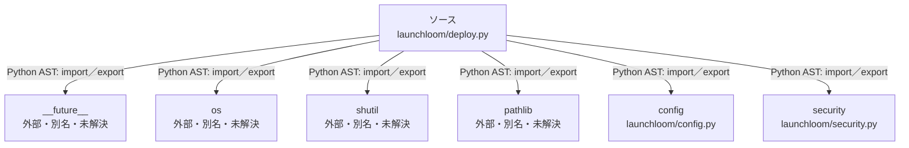

# dependency-map/group-2/n-launchloom-deploy-py-31509e

[解析トップへ戻る](../../../README.md)

確認済みファイル: `launchloom/deploy.py`

解析: Python AST。静的なimport／export参照です。関数の実行順序やHTTP通信は表していません。

宣言: `resolve_target`, `plan`, `publish`

- `__future__` → 外部・標準ライブラリ・別名など。ローカル対応先は未確定
- `os` → 外部・標準ライブラリ・別名など。ローカル対応先は未確定
- `shutil` → 外部・標準ライブラリ・別名など。ローカル対応先は未確定
- `pathlib` → 外部・標準ライブラリ・別名など。ローカル対応先は未確定
- `config` → `launchloom/config.py`（一覧確認・内容未読）
- `security` → `launchloom/security.py`（内容確認済み）

## 要素の説明

### n-config-dfba7a

参照名: `config`

対応する実在ソース: `launchloom/config.py`。内容は未読。

### n-future-05a733

参照名: `__future__`

ローカルのソース対応先を確定できませんでした。外部ライブラリ、標準ライブラリ、型別名などを区別する追加確認が必要です。

### n-os-999a34

参照名: `os`

ローカルのソース対応先を確定できませんでした。外部ライブラリ、標準ライブラリ、型別名などを区別する追加確認が必要です。

### n-pathlib-4471f7

参照名: `pathlib`

ローカルのソース対応先を確定できませんでした。外部ライブラリ、標準ライブラリ、型別名などを区別する追加確認が必要です。

### n-security-8eec7b

参照名: `security`

対応する実在ソース: `launchloom/security.py`。内容確認済み。

### n-shutil-748708

参照名: `shutil`

ローカルのソース対応先を確定できませんでした。外部ライブラリ、標準ライブラリ、型別名などを区別する追加確認が必要です。

### source

`launchloom/deploy.py` の内容を確認しました。

