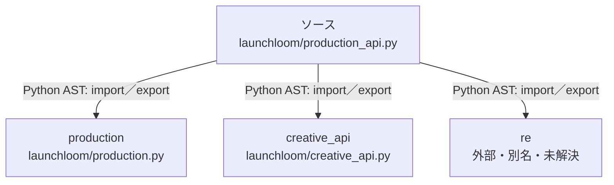

# dependency-map/group-2/n-launchloom-production-api-py-68c981/imports-2

[解析トップへ戻る](../../../../README.md)

import参照の表示用グループ。

## 要素の説明

### n-creative-api-b927ce

参照名: `creative_api`

対応する実在ソース: `launchloom/creative_api.py`。内容は未読。

### n-production-90a883

参照名: `production`

対応する実在ソース: `launchloom/production.py`。内容は未読。

### n-re-c387c9

参照名: `re`

ローカルのソース対応先を確定できませんでした。外部ライブラリ、標準ライブラリ、型別名などを区別する追加確認が必要です。

### source

`launchloom/production_api.py` の内容を確認しました。

