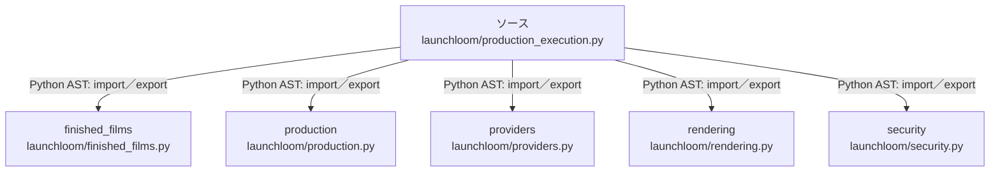

# dependency-map/group-2/n-launchloom-production-execution-py-c843c5/imports-3

[解析トップへ戻る](../../../../README.md)

import参照の表示用グループ。

## 要素の説明

### n-finished-films-90dfba

参照名: `finished_films`

対応する実在ソース: `launchloom/finished_films.py`。内容確認済み。

### n-production-90a883

参照名: `production`

対応する実在ソース: `launchloom/production.py`。内容は未読。

### n-providers-d7e351

参照名: `providers`

対応する実在ソース: `launchloom/providers.py`。内容確認済み。

### n-rendering-043dd9

参照名: `rendering`

対応する実在ソース: `launchloom/rendering.py`。内容確認済み。

### n-security-8eec7b

参照名: `security`

対応する実在ソース: `launchloom/security.py`。内容確認済み。

### source

`launchloom/production_execution.py` の内容を確認しました。

