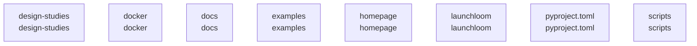

# overall-architecture/group-1

[解析トップへ戻る](../../README.md)

このグループは表示用の区切りです。独立した実行モジュールではありません。

## 要素の説明

### n-design-studies-ba2bad

確認したパス: `design-studies`。配下の登録ファイルは2件。

- `design-studies/index.html`（一覧のみ）
- `design-studies/render.py`（一覧のみ）

[詳細な図と説明を見る](n-design-studies-ba2bad/README.md)

### n-docker-e982f1

確認したパス: `docker`。配下の登録ファイルは1件。

- `docker/chromium-seccomp.json`（一覧のみ）

### n-docs-71ab8b

確認したパス: `docs`。配下の登録ファイルは53件。

- `docs/API.md`（一覧のみ）
- `docs/ARCHITECTURE.md`（一覧のみ）
- `docs/CAMERA.md`（一覧のみ）
- `docs/COMPATIBILITY.md`（一覧のみ）
- `docs/CREATIVE_STUDIO.md`（一覧のみ）
- `docs/CREATIVE_WORKFLOWS.md`（一覧のみ）
- `docs/FIRST_PROOF.md`（一覧のみ）
- `docs/HORIO_PREMIUM_WEB.md`（一覧のみ）
- `docs/INTEGRATIONS.md`（一覧のみ）
- `docs/OBSIDIAN.md`（一覧のみ）
- `docs/PORTFOLIO_VERIFICATION.md`（一覧のみ）
- `docs/PRODUCTION_HANDOFF.md`（一覧のみ）
- `docs/QUIET_CINEMA.md`（一覧のみ）
- `docs/ROADMAP.md`（一覧のみ）
- `docs/SECURITY.md`（一覧のみ）
- `docs/VERIFICATION.md`（一覧のみ）
- `docs/evidence/portfolio-20260913.json`（一覧のみ）
- `docs/evidence/portfolio-browser-20260913/agent-team-1280.png`（一覧のみ）
- `docs/evidence/portfolio-browser-20260913/agent-team-390.png`（一覧のみ）
- `docs/evidence/portfolio-browser-20260913/ai-meeting-1280.png`（一覧のみ）
- `docs/evidence/portfolio-browser-20260913/ai-meeting-390.png`（一覧のみ）
- `docs/evidence/portfolio-browser-20260913/aisecure-1280.png`（一覧のみ）
- `docs/evidence/portfolio-browser-20260913/aisecure-390.png`（一覧のみ）
- `docs/evidence/portfolio-browser-20260913/checks.json`（一覧のみ）
- `docs/evidence/portfolio-browser-20260913/genie-1280.png`（一覧のみ）
- `docs/evidence/portfolio-browser-20260913/genie-390.png`（一覧のみ）
- `docs/evidence/portfolio-browser-20260913/oathra-1280.png`（一覧のみ）
- `docs/evidence/portfolio-browser-20260913/oathra-390.png`（一覧のみ）
- `docs/evidence/portfolio-media-20260913.json`（一覧のみ）
- `docs/quality/acceptance.md`（一覧のみ）
- `docs/quality/claims.md`（一覧のみ）
- `docs/quality/manual-verification.md`（一覧のみ）
- `docs/quality/ux-improvement.md`（一覧のみ）
- `docs/quality/verification.md`（一覧のみ）
- `docs/screenshots/demo.gif`（一覧のみ）

[詳細な図と説明を見る](n-docs-71ab8b/README.md)

### n-examples-99345c

確認したパス: `examples`。配下の登録ファイルは5件。

- `examples/browser-capture.json`（一覧のみ）
- `examples/client.py`（一覧のみ）
- `examples/orbit-brief.json`（一覧のみ）
- `examples/verify_artifacts.py`（一覧のみ）
- `examples/verify_ui.py`（一覧のみ）

[詳細な図と説明を見る](n-examples-99345c/README.md)

### n-homepage-568be0

確認したパス: `homepage`。配下の登録ファイルは62件。

- `homepage/README.md`（一覧のみ）
- `homepage/camera-poster.jpg`（一覧のみ）
- `homepage/camera.mp4`（一覧のみ）
- `homepage/captions.vtt`（一覧のみ）
- `homepage/check.py`（一覧のみ）
- `homepage/film-vertical.mp4`（一覧のみ）
- `homepage/film.mp4`（一覧のみ）
- `homepage/generated-page.png`（一覧のみ）
- `homepage/horio-premium.css`（一覧のみ）
- `homepage/horio-premium.js`（一覧のみ）
- `homepage/index.html`（一覧のみ）
- `homepage/intro-poster.jpg`（一覧のみ）
- `homepage/intro-vertical-poster.jpg`（一覧のみ）
- `homepage/intro-vertical.mp4`（一覧のみ）
- `homepage/intro.mp4`（一覧のみ）
- `homepage/ja/camera-poster.jpg`（一覧のみ）
- `homepage/ja/camera.mp4`（一覧のみ）
- `homepage/ja/captions.vtt`（一覧のみ）
- `homepage/ja/film-vertical.mp4`（一覧のみ）
- `homepage/ja/film.mp4`（一覧のみ）
- `homepage/ja/generated-page.png`（一覧のみ）
- `homepage/ja/index.html`（一覧のみ）
- `homepage/ja/intro-poster.jpg`（一覧のみ）
- `homepage/ja/intro-vertical-poster.jpg`（一覧のみ）
- `homepage/ja/intro-vertical.mp4`（一覧のみ）
- `homepage/ja/intro.mp4`（一覧のみ）
- `homepage/ja/kit-site/film.mp4`（一覧のみ）
- `homepage/ja/kit-site/index.html`（一覧のみ）
- `homepage/ja/kit-site/poster.jpg`（一覧のみ）
- `homepage/ja/kit-site/site.css`（一覧のみ）
- `homepage/ja/kit-site/site.js`（一覧のみ）
- `homepage/ja/launch-kit.zip`（一覧のみ）
- `homepage/ja/og.png`（一覧のみ）
- `homepage/ja/poster-vertical.jpg`（一覧のみ）
- `homepage/ja/poster.jpg`（一覧のみ）

[詳細な図と説明を見る](n-homepage-568be0/README.md)

### n-launchloom-8638dc

確認したパス: `launchloom`。配下の登録ファイルは56件。

- `launchloom/__init__.py`（一覧のみ）
- `launchloom/__main__.py`（一覧のみ）
- `launchloom/capture.py`（一覧のみ）
- `launchloom/claims.py`（一覧のみ）
- `launchloom/cli.py`（内容確認済み）
- `launchloom/config.py`（一覧のみ）
- `launchloom/contracts.py`（内容確認済み）
- `launchloom/creative.py`（一覧のみ）
- `launchloom/creative_api.py`（一覧のみ）
- `launchloom/creative_assistant.py`（一覧のみ）
- `launchloom/creative_edits.py`（一覧のみ）
- `launchloom/creative_package.py`（一覧のみ）
- `launchloom/creative_quality.py`（一覧のみ）
- `launchloom/creative_readiness.py`（一覧のみ）
- `launchloom/creative_rendering.py`（一覧のみ）
- `launchloom/creative_workflow_api.py`（一覧のみ）
- `launchloom/deploy.py`（内容確認済み）
- `launchloom/finished_films.py`（内容確認済み）
- `launchloom/models.py`（内容確認済み）
- `launchloom/pipeline.py`（内容確認済み）
- `launchloom/planning.py`（内容確認済み）
- `launchloom/post_copy.py`（一覧のみ）
- `launchloom/production.py`（一覧のみ）
- `launchloom/production_api.py`（内容確認済み）
- `launchloom/production_execution.py`（内容確認済み）
- `launchloom/providers.py`（内容確認済み）
- `launchloom/rendering.py`（内容確認済み）
- `launchloom/security.py`（内容確認済み）
- `launchloom/selftest.py`（一覧のみ）
- `launchloom/server.py`（内容確認済み）
- `launchloom/site.py`（一覧のみ）
- `launchloom/store.py`（内容確認済み）
- `launchloom/templates/site.css`（一覧のみ）
- `launchloom/templates/site.html`（一覧のみ）
- `launchloom/templates/site.js`（一覧のみ）

[詳細な図と説明を見る](n-launchloom-8638dc/README.md)

### n-pyproject-toml-5d07e7

確認したパス: `pyproject.toml`。配下の登録ファイルは1件。

- `pyproject.toml`（内容確認済み）

### n-scripts-16728d

確認したパス: `scripts`。配下の登録ファイルは7件。

- `scripts/build-portfolio-kits.py`（一覧のみ）
- `scripts/edit-demo.py`（一覧のみ）
- `scripts/record-demo.py`（一覧のみ）
- `scripts/verify-homepage.py`（一覧のみ）
- `scripts/verify-local-quality.py`（一覧のみ）
- `scripts/verify-portfolio-kits.py`（一覧のみ）
- `scripts/verify-production-workspace.py`（一覧のみ）

[詳細な図と説明を見る](n-scripts-16728d/README.md)

