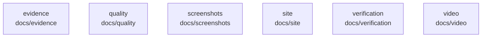

# overall-architecture/group-1/n-docs-71ab8b

[解析トップへ戻る](../../../README.md)

確認したパス: `docs`。配下の登録ファイルは53件。

- `docs/API.md`（一覧のみ）
- `docs/ARCHITECTURE.md`（一覧のみ）
- `docs/CAMERA.md`（一覧のみ）
- `docs/COMPATIBILITY.md`（一覧のみ）
- `docs/CREATIVE_STUDIO.md`（一覧のみ）
- `docs/CREATIVE_WORKFLOWS.md`（一覧のみ）
- `docs/FIRST_PROOF.md`（一覧のみ）
- `docs/HORIO_PREMIUM_WEB.md`（一覧のみ）
- `docs/INTEGRATIONS.md`（一覧のみ）
- `docs/OBSIDIAN.md`（一覧のみ）
- `docs/PORTFOLIO_VERIFICATION.md`（一覧のみ）
- `docs/PRODUCTION_HANDOFF.md`（一覧のみ）
- `docs/QUIET_CINEMA.md`（一覧のみ）
- `docs/ROADMAP.md`（一覧のみ）
- `docs/SECURITY.md`（一覧のみ）
- `docs/VERIFICATION.md`（一覧のみ）
- `docs/evidence/portfolio-20260913.json`（一覧のみ）
- `docs/evidence/portfolio-browser-20260913/agent-team-1280.png`（一覧のみ）
- `docs/evidence/portfolio-browser-20260913/agent-team-390.png`（一覧のみ）
- `docs/evidence/portfolio-browser-20260913/ai-meeting-1280.png`（一覧のみ）
- `docs/evidence/portfolio-browser-20260913/ai-meeting-390.png`（一覧のみ）
- `docs/evidence/portfolio-browser-20260913/aisecure-1280.png`（一覧のみ）
- `docs/evidence/portfolio-browser-20260913/aisecure-390.png`（一覧のみ）
- `docs/evidence/portfolio-browser-20260913/checks.json`（一覧のみ）
- `docs/evidence/portfolio-browser-20260913/genie-1280.png`（一覧のみ）
- `docs/evidence/portfolio-browser-20260913/genie-390.png`（一覧のみ）
- `docs/evidence/portfolio-browser-20260913/oathra-1280.png`（一覧のみ）
- `docs/evidence/portfolio-browser-20260913/oathra-390.png`（一覧のみ）
- `docs/evidence/portfolio-media-20260913.json`（一覧のみ）
- `docs/quality/acceptance.md`（一覧のみ）
- `docs/quality/claims.md`（一覧のみ）
- `docs/quality/manual-verification.md`（一覧のみ）
- `docs/quality/ux-improvement.md`（一覧のみ）
- `docs/quality/verification.md`（一覧のみ）
- `docs/screenshots/demo.gif`（一覧のみ）

## 要素の説明

### n-docs-evidence-3d7bf7

実在パス: `docs/evidence`。13ファイル。

- `docs/evidence/portfolio-20260913.json`
- `docs/evidence/portfolio-browser-20260913/agent-team-1280.png`
- `docs/evidence/portfolio-browser-20260913/agent-team-390.png`
- `docs/evidence/portfolio-browser-20260913/ai-meeting-1280.png`
- `docs/evidence/portfolio-browser-20260913/ai-meeting-390.png`
- `docs/evidence/portfolio-browser-20260913/aisecure-1280.png`
- `docs/evidence/portfolio-browser-20260913/aisecure-390.png`
- `docs/evidence/portfolio-browser-20260913/checks.json`
- `docs/evidence/portfolio-browser-20260913/genie-1280.png`
- `docs/evidence/portfolio-browser-20260913/genie-390.png`
- `docs/evidence/portfolio-browser-20260913/oathra-1280.png`
- `docs/evidence/portfolio-browser-20260913/oathra-390.png`
- `docs/evidence/portfolio-media-20260913.json`

### n-docs-quality-8a58ae

実在パス: `docs/quality`。5ファイル。

- `docs/quality/acceptance.md`
- `docs/quality/claims.md`
- `docs/quality/manual-verification.md`
- `docs/quality/ux-improvement.md`
- `docs/quality/verification.md`

### n-docs-screenshots-43be7c

実在パス: `docs/screenshots`。4ファイル。

- `docs/screenshots/demo.gif`
- `docs/screenshots/review-gate.png`
- `docs/screenshots/studio-ready.png`
- `docs/screenshots/studio.png`

### n-docs-site-5e78da

実在パス: `docs/site`。7ファイル。

- `docs/site/ACCEPTANCE.md`
- `docs/site/CONTENT.md`
- `docs/site/DESIGN.md`
- `docs/site/PRODUCT.md`
- `docs/site/candidates/a.html`
- `docs/site/candidates/b.html`
- `docs/site/candidates/c.html`

### n-docs-verification-de8061

実在パス: `docs/verification`。3ファイル。

- `docs/verification/artifact-report.json`
- `docs/verification/browser-report.json`
- `docs/verification/pytest.xml`

### n-docs-video-c19968

実在パス: `docs/video`。5ファイル。

- `docs/video/README.md`
- `docs/video/edit-report.json`
- `docs/video/raw-en/marks.json`
- `docs/video/raw/marks.json`
- `docs/video/storyboard.md`

