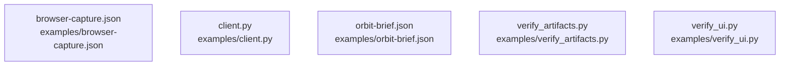

# overall-architecture/group-1/n-examples-99345c

[解析トップへ戻る](../../../README.md)

確認したパス: `examples`。配下の登録ファイルは5件。

- `examples/browser-capture.json`（一覧のみ）
- `examples/client.py`（一覧のみ）
- `examples/orbit-brief.json`（一覧のみ）
- `examples/verify_artifacts.py`（一覧のみ）
- `examples/verify_ui.py`（一覧のみ）

## 要素の説明

### n-examples-browser-capture-json-cbd3e5

実在パス: `examples/browser-capture.json`。1ファイル。

- `examples/browser-capture.json`

### n-examples-client-py-eb343d

実在パス: `examples/client.py`。1ファイル。

- `examples/client.py`

### n-examples-orbit-brief-json-4a0e0b

実在パス: `examples/orbit-brief.json`。1ファイル。

- `examples/orbit-brief.json`

### n-examples-verify-artifacts-py-74a273

実在パス: `examples/verify_artifacts.py`。1ファイル。

- `examples/verify_artifacts.py`

### n-examples-verify-ui-py-872596

実在パス: `examples/verify_ui.py`。1ファイル。

- `examples/verify_ui.py`

