# overall-architecture/group-1/n-homepage-568be0/group-1

[解析トップへ戻る](../../../../README.md)

このグループは表示用の区切りです。独立した実行モジュールではありません。

```mermaid
graph TD
    n-homepage-ja-c46cc6["ja\nhomepage/ja"]
    n-homepage-kit-site-4f0942["kit-site\nhomepage/kit-site"]
    n-homepage-check-py-f1c8c9["check.py\nhomepage/check.py"]
    n-homepage-horio-premium-js-99c896["horio-premium.js\nhomepage/horio-premium.js"]
    n-homepage-index-html-fe735d["index.html\nhomepage/index.html"]
    n-homepage-portfolio-js-643780["portfolio.js\nhomepage/portfolio.js"]
    n-homepage-publish-py-621c97["publish.py\nhomepage/publish.py"]
    n-homepage-publish-post-samples-py-91badb["publish_post_samples.py\nhomepage/publish_post_samples.py"]
```

## 要素の説明

### n-homepage-check-py-f1c8c9

実在パス: `homepage/check.py`。1ファイル。

- `homepage/check.py`

### n-homepage-horio-premium-js-99c896

実在パス: `homepage/horio-premium.js`。1ファイル。

- `homepage/horio-premium.js`

### n-homepage-index-html-fe735d

実在パス: `homepage/index.html`。1ファイル。

- `homepage/index.html`

### n-homepage-ja-c46cc6

実在パス: `homepage/ja`。21ファイル。

- `homepage/ja/camera-poster.jpg`
- `homepage/ja/camera.mp4`
- `homepage/ja/captions.vtt`
- `homepage/ja/film-vertical.mp4`
- `homepage/ja/film.mp4`
- `homepage/ja/generated-page.png`
- `homepage/ja/index.html`
- `homepage/ja/intro-poster.jpg`
- `homepage/ja/intro-vertical-poster.jpg`
- `homepage/ja/intro-vertical.mp4`
- `homepage/ja/intro.mp4`
- `homepage/ja/kit-site/film.mp4`
- `homepage/ja/kit-site/index.html`
- `homepage/ja/kit-site/poster.jpg`
- `homepage/ja/kit-site/site.css`
- `homepage/ja/kit-site/site.js`
- `homepage/ja/launch-kit.zip`
- `homepage/ja/og.png`
- `homepage/ja/poster-vertical.jpg`
- `homepage/ja/poster.jpg`
- `homepage/ja/review-gate.png`

### n-homepage-kit-site-4f0942

実在パス: `homepage/kit-site`。5ファイル。

- `homepage/kit-site/film.mp4`
- `homepage/kit-site/index.html`
- `homepage/kit-site/poster.jpg`
- `homepage/kit-site/site.css`
- `homepage/kit-site/site.js`

### n-homepage-portfolio-js-643780

実在パス: `homepage/portfolio.js`。1ファイル。

- `homepage/portfolio.js`

### n-homepage-publish-post-samples-py-91badb

実在パス: `homepage/publish_post_samples.py`。1ファイル。

- `homepage/publish_post_samples.py`

### n-homepage-publish-py-621c97

実在パス: `homepage/publish.py`。1ファイル。

- `homepage/publish.py`

