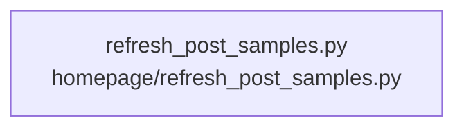

# overall-architecture/group-1/n-homepage-568be0/group-2

[解析トップへ戻る](../../../../README.md)

このグループは表示用の区切りです。独立した実行モジュールではありません。

## 要素の説明

### n-homepage-refresh-post-samples-py-62f277

実在パス: `homepage/refresh_post_samples.py`。1ファイル。

- `homepage/refresh_post_samples.py`

