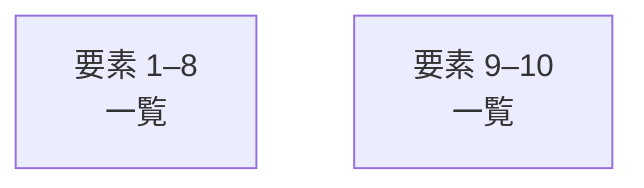

# overall-architecture/group-1/n-launchloom-8638dc

[解析トップへ戻る](../../../README.md)

確認したパス: `launchloom`。配下の登録ファイルは56件。

- `launchloom/__init__.py`（一覧のみ）
- `launchloom/__main__.py`（一覧のみ）
- `launchloom/capture.py`（一覧のみ）
- `launchloom/claims.py`（一覧のみ）
- `launchloom/cli.py`（内容確認済み）
- `launchloom/config.py`（一覧のみ）
- `launchloom/contracts.py`（内容確認済み）
- `launchloom/creative.py`（一覧のみ）
- `launchloom/creative_api.py`（一覧のみ）
- `launchloom/creative_assistant.py`（一覧のみ）
- `launchloom/creative_edits.py`（一覧のみ）
- `launchloom/creative_package.py`（一覧のみ）
- `launchloom/creative_quality.py`（一覧のみ）
- `launchloom/creative_readiness.py`（一覧のみ）
- `launchloom/creative_rendering.py`（一覧のみ）
- `launchloom/creative_workflow_api.py`（一覧のみ）
- `launchloom/deploy.py`（内容確認済み）
- `launchloom/finished_films.py`（内容確認済み）
- `launchloom/models.py`（内容確認済み）
- `launchloom/pipeline.py`（内容確認済み）
- `launchloom/planning.py`（内容確認済み）
- `launchloom/post_copy.py`（一覧のみ）
- `launchloom/production.py`（一覧のみ）
- `launchloom/production_api.py`（内容確認済み）
- `launchloom/production_execution.py`（内容確認済み）
- `launchloom/providers.py`（内容確認済み）
- `launchloom/rendering.py`（内容確認済み）
- `launchloom/security.py`（内容確認済み）
- `launchloom/selftest.py`（一覧のみ）
- `launchloom/server.py`（内容確認済み）
- `launchloom/site.py`（一覧のみ）
- `launchloom/store.py`（内容確認済み）
- `launchloom/templates/site.css`（一覧のみ）
- `launchloom/templates/site.html`（一覧のみ）
- `launchloom/templates/site.js`（一覧のみ）

## 要素の説明

### group-1

このグループは表示用の区切りです。独立した実行モジュールではありません。

[詳細な図と説明を見る](group-1/README.md)

### group-2

このグループは表示用の区切りです。独立した実行モジュールではありません。

[詳細な図と説明を見る](group-2/README.md)

