# overall-architecture/group-1/n-launchloom-8638dc/group-1

[解析トップへ戻る](../../../../README.md)

このグループは表示用の区切りです。独立した実行モジュールではありません。

```mermaid
graph TD
    n-launchloom-templates-f4528c["templates\nlaunchloom/templates"]
    n-launchloom-web-f1ea64["web\nlaunchloom/web"]
    n-launchloom-init-py-5da67a["__init__.py\nlaunchloom/__init__.py"]
    n-launchloom-main-py-2003cd["__main__.py\nlaunchloom/__main__.py"]
    n-launchloom-capture-py-f664f2["capture.py\nlaunchloom/capture.py"]
    n-launchloom-claims-py-61fe86["claims.py\nlaunchloom/claims.py"]
    n-launchloom-cli-py-93b636["cli.py\nlaunchloom/cli.py"]
    n-launchloom-config-py-ed6b54["config.py\nlaunchloom/config.py"]
```

## 要素の説明

### n-launchloom-capture-py-f664f2

実在パス: `launchloom/capture.py`。1ファイル。

- `launchloom/capture.py`

### n-launchloom-claims-py-61fe86

実在パス: `launchloom/claims.py`。1ファイル。

- `launchloom/claims.py`

### n-launchloom-cli-py-93b636

実在パス: `launchloom/cli.py`。1ファイル。

- `launchloom/cli.py`

### n-launchloom-config-py-ed6b54

実在パス: `launchloom/config.py`。1ファイル。

- `launchloom/config.py`

### n-launchloom-init-py-5da67a

実在パス: `launchloom/__init__.py`。1ファイル。

- `launchloom/__init__.py`

### n-launchloom-main-py-2003cd

実在パス: `launchloom/__main__.py`。1ファイル。

- `launchloom/__main__.py`

### n-launchloom-templates-f4528c

実在パス: `launchloom/templates`。3ファイル。

- `launchloom/templates/site.css`
- `launchloom/templates/site.html`
- `launchloom/templates/site.js`

### n-launchloom-web-f1ea64

実在パス: `launchloom/web`。21ファイル。

- `launchloom/web/app-base.css`
- `launchloom/web/app.css`
- `launchloom/web/app.js`
- `launchloom/web/creative-entry.js`
- `launchloom/web/creative-studio.css`
- `launchloom/web/creative-studio.html`
- `launchloom/web/creative-studio.js`
- `launchloom/web/creative-workflow.js`
- `launchloom/web/demo-app.css`
- `launchloom/web/demo-app.html`
- `launchloom/web/demo-app.js`
- `launchloom/web/final-films.js`
- `launchloom/web/i18n.js`
- `launchloom/web/index.html`
- `launchloom/web/obsidian-board.css`
- `launchloom/web/obsidian.css`
- `launchloom/web/production.css`
- `launchloom/web/production.html`
- `launchloom/web/production.js`
- `launchloom/web/quiet-cinema.css`
- `launchloom/web/workspace.css`

