# overall-architecture/group-1/n-scripts-16728d

[解析トップへ戻る](../../../README.md)

確認したパス: `scripts`。配下の登録ファイルは7件。

- `scripts/build-portfolio-kits.py`（一覧のみ）
- `scripts/edit-demo.py`（一覧のみ）
- `scripts/record-demo.py`（一覧のみ）
- `scripts/verify-homepage.py`（一覧のみ）
- `scripts/verify-local-quality.py`（一覧のみ）
- `scripts/verify-portfolio-kits.py`（一覧のみ）
- `scripts/verify-production-workspace.py`（一覧のみ）

```mermaid
graph TD
    n-scripts-build-portfolio-kits-py-9beb31["build-portfolio-kits.py\nscripts/build-portfolio-kits.py"]
    n-scripts-edit-demo-py-51290a["edit-demo.py\nscripts/edit-demo.py"]
    n-scripts-record-demo-py-61a966["record-demo.py\nscripts/record-demo.py"]
    n-scripts-verify-homepage-py-b31c06["verify-homepage.py\nscripts/verify-homepage.py"]
    n-scripts-verify-local-quality-py-f27e52["verify-local-quality.py\nscripts/verify-local-quality.py"]
    n-scripts-verify-portfolio-kits-py-e6cf29["verify-portfolio-kits.py\nscripts/verify-portfolio-kits.py"]
    n-scripts-verify-production-workspace-py-53485e["verify-production-workspace.py\nscripts/verify-production-workspace.py"]
```

## 要素の説明

### n-scripts-build-portfolio-kits-py-9beb31

実在パス: `scripts/build-portfolio-kits.py`。1ファイル。

- `scripts/build-portfolio-kits.py`

### n-scripts-edit-demo-py-51290a

実在パス: `scripts/edit-demo.py`。1ファイル。

- `scripts/edit-demo.py`

### n-scripts-record-demo-py-61a966

実在パス: `scripts/record-demo.py`。1ファイル。

- `scripts/record-demo.py`

### n-scripts-verify-homepage-py-b31c06

実在パス: `scripts/verify-homepage.py`。1ファイル。

- `scripts/verify-homepage.py`

### n-scripts-verify-local-quality-py-f27e52

実在パス: `scripts/verify-local-quality.py`。1ファイル。

- `scripts/verify-local-quality.py`

### n-scripts-verify-portfolio-kits-py-e6cf29

実在パス: `scripts/verify-portfolio-kits.py`。1ファイル。

- `scripts/verify-portfolio-kits.py`

### n-scripts-verify-production-workspace-py-53485e

実在パス: `scripts/verify-production-workspace.py`。1ファイル。

- `scripts/verify-production-workspace.py`

