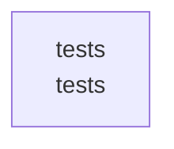

# overall-architecture/group-2

[解析トップへ戻る](../../README.md)

このグループは表示用の区切りです。独立した実行モジュールではありません。

## 要素の説明

### n-tests-04d13f

確認したパス: `tests`。配下の登録ファイルは27件。

- `tests/browser_journey.py`（一覧のみ）
- `tests/creative_browser_journey.py`（一覧のみ）
- `tests/creative_workflow_browser_journey.py`（一覧のみ）
- `tests/first_success_browser_journey.py`（一覧のみ）
- `tests/test_claims.py`（一覧のみ）
- `tests/test_core.py`（一覧のみ）
- `tests/test_creative.py`（一覧のみ）
- `tests/test_creative_api.py`（一覧のみ）
- `tests/test_creative_assistant.py`（一覧のみ）
- `tests/test_creative_readiness.py`（一覧のみ）
- `tests/test_creative_rendering.py`（一覧のみ）
- `tests/test_creative_workflow.py`（一覧のみ）
- `tests/test_design_studies.py`（一覧のみ）
- `tests/test_finished_films.py`（一覧のみ）
- `tests/test_first_success_contract.py`（一覧のみ）
- `tests/test_horio_premium_homepage.py`（一覧のみ）
- `tests/test_obsidian_theme.py`（一覧のみ）
- `tests/test_post_copy.py`（一覧のみ）
- `tests/test_production.py`（一覧のみ）
- `tests/test_production_api.py`（一覧のみ）
- `tests/test_production_execution.py`（一覧のみ）
- `tests/test_production_homepage.py`（一覧のみ）
- `tests/test_providers_and_media.py`（一覧のみ）
- `tests/test_publish_post_samples.py`（一覧のみ）
- `tests/test_quiet_cinema.py`（一覧のみ）
- `tests/test_studio_accessibility.py`（一覧のみ）
- `tests/test_workspace_styles.py`（一覧のみ）

[詳細な図と説明を見る](n-tests-04d13f/README.md)

