# overall-architecture/group-2/n-tests-04d13f

[解析トップへ戻る](../../../README.md)

確認したパス: `tests`。配下の登録ファイルは27件。

- `tests/browser_journey.py`（一覧のみ）
- `tests/creative_browser_journey.py`（一覧のみ）
- `tests/creative_workflow_browser_journey.py`（一覧のみ）
- `tests/first_success_browser_journey.py`（一覧のみ）
- `tests/test_claims.py`（一覧のみ）
- `tests/test_core.py`（一覧のみ）
- `tests/test_creative.py`（一覧のみ）
- `tests/test_creative_api.py`（一覧のみ）
- `tests/test_creative_assistant.py`（一覧のみ）
- `tests/test_creative_readiness.py`（一覧のみ）
- `tests/test_creative_rendering.py`（一覧のみ）
- `tests/test_creative_workflow.py`（一覧のみ）
- `tests/test_design_studies.py`（一覧のみ）
- `tests/test_finished_films.py`（一覧のみ）
- `tests/test_first_success_contract.py`（一覧のみ）
- `tests/test_horio_premium_homepage.py`（一覧のみ）
- `tests/test_obsidian_theme.py`（一覧のみ）
- `tests/test_post_copy.py`（一覧のみ）
- `tests/test_production.py`（一覧のみ）
- `tests/test_production_api.py`（一覧のみ）
- `tests/test_production_execution.py`（一覧のみ）
- `tests/test_production_homepage.py`（一覧のみ）
- `tests/test_providers_and_media.py`（一覧のみ）
- `tests/test_publish_post_samples.py`（一覧のみ）
- `tests/test_quiet_cinema.py`（一覧のみ）
- `tests/test_studio_accessibility.py`（一覧のみ）
- `tests/test_workspace_styles.py`（一覧のみ）

```mermaid
graph TD
    n-tests-browser-journey-py-52f5f2["browser_journey.py\ntests/browser_journey.py"]
    n-tests-creative-browser-journey-py-b4d90f["creative_browser_journey.py\ntests/creative_browser_journey.py"]
    n-tests-creative-workflow-browser-journey-py-00c2fb["creative_workflow_browser_journey.py\ntests/creative_workflow_browser_journey.py"]
    n-tests-first-success-browser-journey-py-c3d6c2["first_success_browser_journey.py\ntests/first_success_browser_journey.py"]
    n-tests-test-claims-py-726966["test_claims.py\ntests/test_claims.py"]
    n-tests-test-core-py-d2ea59["test_core.py\ntests/test_core.py"]
    n-tests-test-creative-py-f52c27["test_creative.py\ntests/test_creative.py"]
    n-tests-test-creative-api-py-eb7516["test_creative_api.py\ntests/test_creative_api.py"]
```

## 要素の説明

### n-tests-browser-journey-py-52f5f2

実在パス: `tests/browser_journey.py`。1ファイル。

- `tests/browser_journey.py`

### n-tests-creative-browser-journey-py-b4d90f

実在パス: `tests/creative_browser_journey.py`。1ファイル。

- `tests/creative_browser_journey.py`

### n-tests-creative-workflow-browser-journey-py-00c2fb

実在パス: `tests/creative_workflow_browser_journey.py`。1ファイル。

- `tests/creative_workflow_browser_journey.py`

### n-tests-first-success-browser-journey-py-c3d6c2

実在パス: `tests/first_success_browser_journey.py`。1ファイル。

- `tests/first_success_browser_journey.py`

### n-tests-test-claims-py-726966

実在パス: `tests/test_claims.py`。1ファイル。

- `tests/test_claims.py`

### n-tests-test-core-py-d2ea59

実在パス: `tests/test_core.py`。1ファイル。

- `tests/test_core.py`

### n-tests-test-creative-api-py-eb7516

実在パス: `tests/test_creative_api.py`。1ファイル。

- `tests/test_creative_api.py`

### n-tests-test-creative-py-f52c27

実在パス: `tests/test_creative.py`。1ファイル。

- `tests/test_creative.py`

